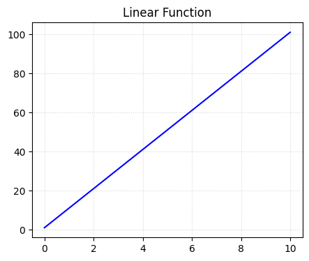
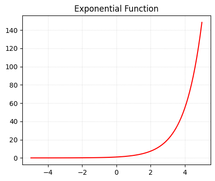
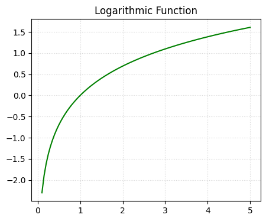
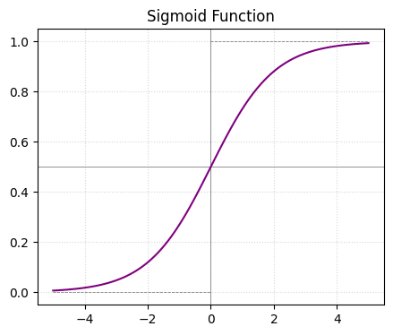

# Python 함수와 그래프

## 🎯 목표
1. 선형 함수(Linear Function)
2. 지수 함수(Exponential Function)
3. 로그 함수(Logarithmic Function)
4. 시그모이드 함수(Sigmoid Function)

---

## 1. 선형 함수(Linear Function)
**공식**
- $f(x) = wx + b$  
- $w$ (Weight): 기울기, 독립변수 $x$가 변할 때 종속변수가 변하는 정도  
- $b$ (Bias): 절편, 모든 입력이 0일 때의 기본값

**그래프**
- 직선성 : 변수 간의 비례 관계를 나타낸다. (변환율이 일정하다.)
- $x$가 커질 때 $y$가 일정한 비율로 증가하거나 감소

헬스케어 데이터 예시
- 수면시간이 늘어날수록 스트레스 지수가 감소하는 관계
- '수면을 1시간 더 잘 떄마다 스트레스 지수는 항상 5포인트씩 감소한다.' → 원인과 결과가 정직하게 비례
- 기울기가 가파를수록 적은 수면 시간으로도 큰 스트레스 감소 효과를 본다는 의미로 해석 가능

## 지수 함수(Exponential Function)
**공식**
- $f(x) = e^x$
- $x$가 커짐에 따라 $y$값이 기하급수적으로 증가한다.
- 초반에는 완만하다가 특정 임계점을 넘으면 걷잡을 수 없이 커진다.

헬스케어 데이터 예시
- 초기에는 박테리아 수가 적어 증식이 더디지만, 수가 많아지면서 증식 속도에 가속도가 붙음
- '시간이 조금만 더 지나도 상황이 걷잡을 수 없이 악화될 수 있다.'는 긴급 상황을 시각적으로 경고함
- 따라서 초기 단계의 개입이 얼마나 중요한 의미인지 해석 가능

## 로그 함수(Logarithmic Function)
**공식**
- $f(x) = \log_a(x)$
- $x$가 커질수록 $y$의 증가 폭이 점차 줄어든다.
- 매우 큰 범위의 데이터를 좁은 범위로 압축하여 처리하기 좋다. (Log Scaling)

헬스케어 데이터 예시
- 투여된 약물의 용량에 따른 통증 수치 감소
- 특정 용량까지는 효과가 크지만, 그 이상 투여해도 효과의 증가 폭이 미미해지는 수확 체감의 법칙을 시각적으로 보여준다.

## 시그모이드 함수 (Sigmoid Function)
**공식**
- $\sigma(x) = \frac{1}{1 + e^{-x}}$
- $y$값은 항상 0과 1 사이($0 < y < 1$)에 존재한다.
- 실수 전체 범위의 값을 확률로 변환하는 데 최적
- 로지스틱 회귀와 신경망의 활성화 함수로 쓰인다.

헬스케어 데이터 예시
- 건강 검진 지표를 종합하여 암 발생 확률 계산
- $y$값이 0.5보다 크면 '위험(1)', 작으면 '정상(0)'으로 분류하는 이진 분류의 핵심 로직

