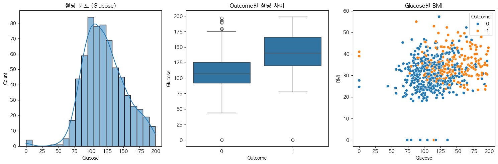

# Python 데이터분석 및 시각화

## 🎯 목표
1. 문제 정의
2. 데이터 불러오기
3. 탐색적 데이터 분석(EDA)
4. 시각화
5. 결론
---

## 1. 문제 정의(Problem Definition)
### "어떤 요인이 당뇨병(Outcome)에 가장 큰 영향을 미칠까?"
- 가설1 : 혈당이 높을수록 당뇨병일 확률이 높다.
- 가설2 : BMI가 높으면 당뇨병 발병 가능성이 높다.
- 가설3 : 나이가 많을수록 당뇨병 위험이 높을 수 있다.

## 2. 데이터 불러오기(Loading Data)
```Python
import pandas as pd

df = pd.read_csv('./train.csv')
print(df)
```

## 3. 탐색적 데이터 분석(EDA: Exploratory Data Analysis)
### 3-1. 데이터 구조 및 기초통계 확인
```Python
print(df.info())
print(df.head())
print(df.describe())
print(df.columns)
# Index(['ID', 'Pregnancies', 'Glucose', 'BloodPressure', 'SkinThickness',
#       'Insulin', 'BMI', 'DiabetesPedigreeFunction', 'Age', 'Outcome'],
#      dtype='object')
```
feature에 대한 이해
|feature| 해석 포인트 |
|-------|----------|
|Glucose|인슐린 저항성 → 당뇨 위험 급상승|
|BMI|비만으로 인해 인슐린 감수성 저하|
|Age|대사율 저하 + 생황습관 누적|
|Pregnancies|임신성 당뇨 이력 가능성|
|Insulin|0인 데이터 → 미측정으로 인해  결측 처리 필요|
|SkinThickness|지방 두께 증가 → 대사 이상 징후|
|DPF|가족력 존재 시 유전적 위험|

### 3-2. 결측치 확인
```Python
# 결측치 확인
print(df.isnull().sum())

# 
cols_zero_as_na = ['Glucose', '"BloodPressure', '"SkinThickness', 'Insulin', 'BMI']
df[cols_zero_as_na] = df[cols_zero_as_na].replace(0, None)
df.isna().mean().sort_values(ascending=False)

df['Glucose'].fillna(df['Glucose'].median(), inplace=True)
```

## 4. 시각화 탐색

```Python
import seaborn as sns
import matplotlib.pyplot as plt

fig, axs = plt.subplots(1, 3, figsize=(15, 5))

# 혈당 분포(단변량)
sns.histplot(df["Glucose"].dropna(), kde=True)
plt.title("혈당 분포 (Glucose)")

# Outcome별 혈당 차이 시각화(이변량)
sns.boxplot(x="Outcome", y="Glucose", data=df)
plt.title("Outcome별 혈당 차이")

# Glucose별 BMI(이변량)
sns.scatterplot(data=df, x='Glucose', y='BMI', hue='Outcome')

plt.tight_layout()
plt.show()
```


### 4-1. 상관관계 분석

```Python
# 상관관계 분석
corr = df.corr(numeric_only=True)
corr['Outcome'].sort_values(ascending=True)

sns.heatmap(corr, annot=True, cmap="coolwarm", fmt=".2f")
plt.title("Feature 상관관계 Heatmap")
plt.show()
```


## 5. 결론(Insight)
- 가설1 : 혈당이 높을수록 당뇨병일 확률이 높다.
- 가설2 : BMI가 높으면 당뇨병 발병 가능성이 높다.
- 가설3 : 나이가 많을수록 당뇨병 위험이 높을 수 있다.

> Outcome과 가장 관련이 있는 변수로는 혈당, BMI, 나이 순서로 관련이 높았다.  
각 변수의 상관관계 히트맵으로 3가지 가설 모두 당뇨병 발병과 큰 관련이 있는 점을 확인할 수 있었다.
