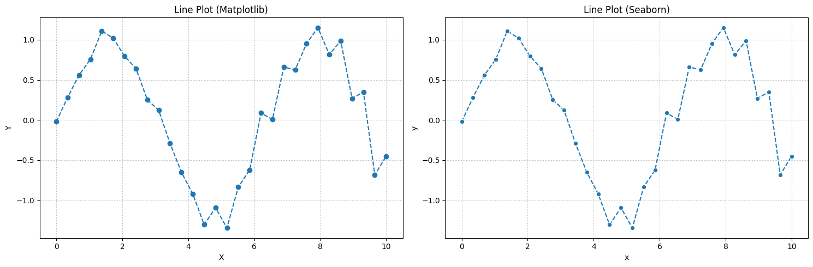
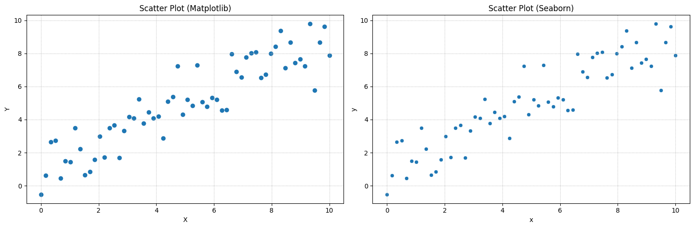
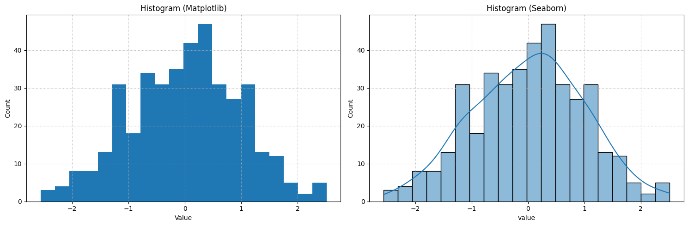
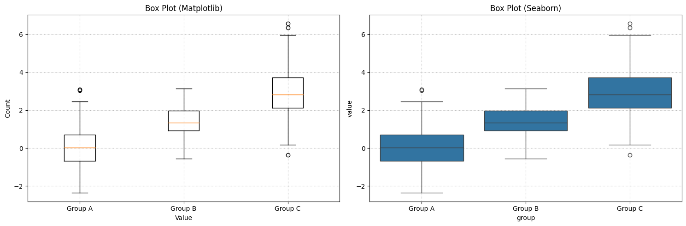
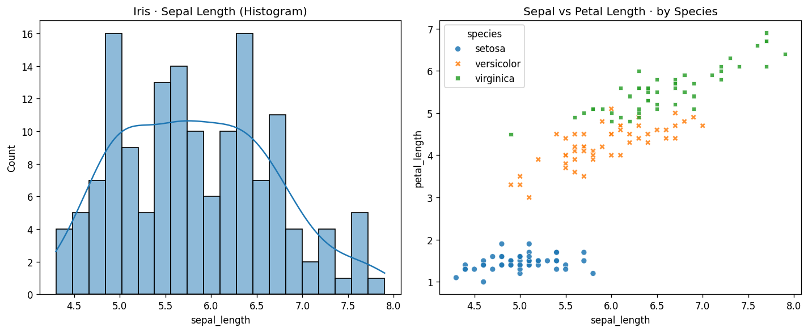
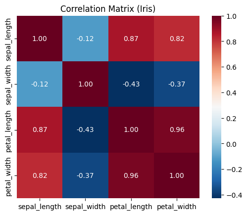

# Python 데이터분석 및 시각화

## 🎯 목표
1. 데이터 분석(Data Analysis)
2. 시각화를 해야하는 이유
3. 라이브러리 비교: Matplotlib vs Seaborn
4. 주요 그래프 구현
5. iris 데이터 시각화 하기
---

## 1. 데이터 분석(Data Analysis)
- 질문에 답하기 위해 데이터를 정리, 요약, 탐색하여 패턴과 이상치를 발견하고 의사결정을 돕는 일련의 활동
- **프로세스** : 데이터 수집 → 정제(결측/이상치) → 탐색(EDA) → 요약/설명 → 전달

|구분|초점|산출물|비유|
|--|--|---|--|
|Data Analysis|설명/요약/인사이트|리포트·대시보드|지도 읽기|
|Data Science|예측/추론/실험|모델·실험결과|내비게이션 만들기|
|Data Engineering|수집/저장/전달|파이프라인·플랫폼|도로 깔기|

## 2. 시각화를 해야하는 이유
- 시각화는 데이터 워크플로 중 **탐색적 데이터 분석(EDA)** 과 결과 전달(스토리텔링) 단계에서 필수적이다.
- **발견(Discovery)**: 표에서 보이지 않는 패턴, 이상치, 군집을 눈으로 즉시 파악
- **검증(Validation)**: 통계적 가정(정규성, 선형성 등)과 전처리 효과를 빠르게 확인
- **전달(Communication)**: 비전문가도 한눈에 이해할 수 있도록 정보 번역
> 비유 : 원시 신호(표)를 그림(그래프)로 번역해 두뇌 친화적으로 보여준다.

### 2-1. 시각화를 하지 않는 다면
- 평균만 보곡 왜곡을 놓치기 쉽다. (꼬리, 이상치, 다봉형 분포)
- 상관 관계가 숫자 한 줄로 축약되어 맥락을 잃는다.
- 설득과 공유가 어려워 의사결정이 지연된다.

### 2-2. 시각화 기본 원칙
- 유형 선택: 질문에 맞는 차트 선택 (단변량, 이변량, 다변량)
- 정직한 표현: 축 범위와 스케일을 왜곡 없이 설정
- 명확성: 범례, 라벨, 단위를 명시하고 색상은 의미가 있을 때만 사용
- 함정 주의: 잘못된 축 절단으로 차이 과장, 과도한 겹침 등 피하기

## 3. 라이브러리 비교: Matplotlib vs Seaborn

- Matplotlib: 저수준 라이브러리. 모든 요소를 직접 제어하며 정교한 커스터마이징에 유리하다.
- Seaborn: 고수준 라이브러리. 통계적 시각화에 최적화되어 있다.

전략: Seaborn으로 빠르게 초안을 잡고, Matplotlib으로 세부 조정을 진행.

## 4. 주요 그래프 구현
```Python
# 예시 데이터
import numpy as np
import pandas as pd
import matplotlib.pyplot as plt
import seaborn as sns

# (1) Line/Scatter용 연속형 데이터
x_line = np.linspace(0, 10, 30)
y_line = np.sin(x_line) + 0.2 * np.random.randn(len(x_line))
x_scatter = np.linspace(0, 10, 60)
y_scatter = 0.7 * x_scatter + 1.5 + np.random.randn(len(x_scatter)) * 1.2

# (2) Bar용 범주형 요약 데이터
categories = ["A","B","C","D"]
values = [23, 17, 35, 29]

# (3) Hist/Box용 분포 데이터
samples_norm = np.random.normal(loc=0, scale=1, size=400)
box_a = np.random.normal(0.0, 1.0, 200)
box_b = np.random.normal(1.5, 0.8, 200)
box_c = np.random.normal(3.0, 1.2, 200)

# (4) Seaborn용 데이터프레임
df_line = pd.DataFrame({"x": x_line,"y": y_line})
df_scatter = pd.DataFrame({"x": x_scatter,"y": y_scatter})
df_bar = pd.DataFrame({"Category":categories, "Value":values})
df_hist = pd.DataFrame({"value": samples_norm})
df_box = pd.DataFrame({
    "group": ["Group A"]*200 + ["Group B"]*200 + ["Group C"]*200,
    "value": np.concatenate([box_a, box_b, box_c])
})
```

### 4-1. Line Plot
```Python
# Matplotlib
plt.figure(figsize=(15, 5))
plt.subplot(121)
plt.plot(x_line, y_line, marker='o', linestyle='--')
plt.title("Line Plot (Matplotlib)")
plt.xlabel("X")
plt.ylabel("Y")
plt.grid(True, linestyle=':')

# Seaborn
plt.subplot(122)
sns.lineplot(data=df_line, x="x", y="y", marker="o", linestyle='--')
plt.title("Line Plot (Seaborn)")
plt.grid(True, linestyle=":")
plt.tight_layout()
plt.show()
```



### 4-2. Scatter Plot
```Python
# Matplotlib
plt.figure(figsize=(15, 5))
plt.subplot(121)
plt.scatter(x_scatter, y_scatter)
plt.title("Scatter Plot (Matplotlib)")
plt.xlabel("X")
plt.ylabel("Y")
plt.grid(True, linestyle=':')

# Seaborn
plt.subplot(122)
sns.scatterplot(data=df_scatter, x="x", y="y")
plt.title("Scatter Plot (Seaborn)")
plt.grid(True, linestyle=":")
plt.tight_layout()
plt.show()
```



### 4-3. Bar Plot
```Python
# Matplotlib
plt.figure(figsize=(15, 5))
plt.subplot(121)
plt.bar(categories, values)
plt.title("Bar Plot (Matplotlib)")
plt.xlabel("Category")
plt.ylabel("Value")
plt.grid(True, linestyle=':')

# Seaborn
plt.subplot(122)
sns.barplot(data=df_bar, x="Category", y="Value")
plt.title("Bar Plot (Seaborn)")
plt.grid(True, linestyle=":")
plt.tight_layout()
plt.show()
```


### 4-4. Histogram
```Python
# Matplotlib
plt.figure(figsize=(15, 5))
plt.subplot(121)
plt.hist(samples_norm, bins=20)
plt.title("Histogram (Matplotlib)")
plt.xlabel("Value")
plt.ylabel("Count")
plt.grid(True, linestyle=':')

# Seaborn
plt.subplot(122)
sns.histplot(data=df_hist, x="value", bins=20, kde=True)
plt.title("Histogram (Seaborn)")
plt.grid(True, linestyle=":")
plt.tight_layout()
plt.show()

```


### 4-1. Box Plot
```Python
# Matplotlib
plt.figure(figsize=(15, 5))
plt.subplot(121)
plt.boxplot([box_a, box_b, box_c], labels=["Group A", "Group B", "Group C"])
plt.title("Box Plot (Matplotlib)")
plt.xlabel("Value")
plt.ylabel("Count")
plt.grid(True, linestyle=':')

# Seaborn
plt.subplot(122)
sns.boxplot(data=df_box, x="group", y="value")
plt.title("Box Plot (Seaborn)")
plt.grid(True, linestyle=":")
plt.tight_layout()
plt.show()
```



## 5. iris 데이터 시각화 하기
```Python
import seaborn as sns

iris = sns.load_dataset("iris")

fig, axes = plt.subplots(1, 2, figsize=(12, 5), dpi=120)

# 히스토그램: Sepal Length 분포
sns.histplot(data=iris, x="sepal_length", bins=20, kde=True, ax=axes[0])
axes[0].set_title("Iris · Sepal Length (Histogram)")

# 산점도: Sepal vs Petal Length (종별 구분)
sns.scatterplot(data=iris, x="sepal_length", y="petal_length", 
                hue="species", style="species", alpha=0.85, ax=axes[1])
axes[1].set_title("Sepal vs Petal Length · by Species")

fig.tight_layout()
plt.show()
```



```Python
# 상관행렬(Heatmap)
iris = sns.load_dataset("iris")
corr = iris.select_dtypes("number").corr()

sns.heatmap(corr, annot=True, fmt=".2f", square=True, cmap='RdBu_r')
plt.title("Correlation Matrix (Iris)")
plt.show()
```

