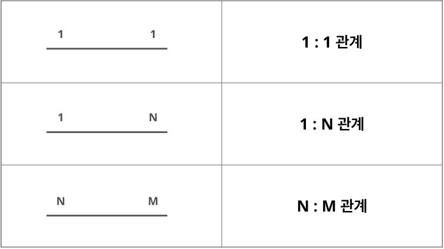
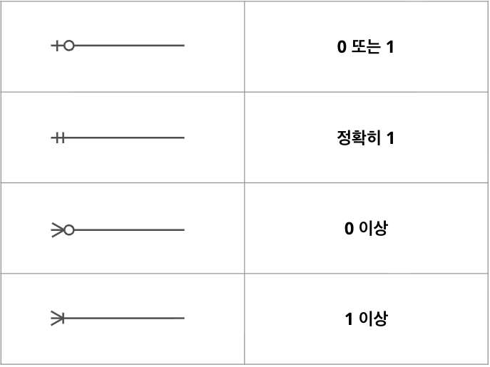

# 헬스케어 DataBase 및 ERD 설계
> 🗓️ **2025-12-23**  
✍🏼 **작성자 : unz**
---

## 📝 목차
1. 데이터(Data)란?
2. 데이터를 저장하는 방법
3. 데이터베이스(DataBase)란?
4. 관계형 데이터베이스(RDB)의 구성 요소
5. 무결성 제약 조건(Integrity Constraints)
6. 데이터 모델링(Data Modeling)
7. ERD(Entity-Relationship Diagram)란?
---

## 1. 데이터(Data)란?
- **데이터(Data)** : 현실 세계에서 관찰하거나 측정하여 수집된 사실과 값
- **정보(Information)** : 데이터를 특정 목적에 의해 해석하거나 가공한 형태

### 1-1. 헬스케어·의료 데이터의 특징
**1. 정형데이터와 비정형데이터가 공존한다.**
- 정형 데이터 : 숫자나 표롤 정리된 데이터 (환자ID, 혈압, 혈당, BMI, 진료일 등)
- 비정형 데이터 : 형식이 일정하지 않은 데이터 (X-ray 이미지, 의사 소견서, 음성 기록 등)
- 의료 DataBase는 두 가지 모두 저장할 수 있어야 한다.

**2. 보안과 개인정보 보호가 최우선된다.**
- 환자 정보, 진료기록 등은 식별 가능한 민감데이터
- 암호화, 접근권한, 로그기록, 익명화가 필수이다.
- 의료법, 개인정보보호법, HIPAA 등 법적 규제를 따라야한다.

**3. 정확성과 일관성 (무결성)이 매우 중요하다.**
- 진료기록 하나의 오타, 중복이 생명에 영향을 줄 수 있어 관계형 DB를 주로 사용한다.

**4. 대용량 + 장기 저장이 필요하다.**
- 의료 데이터는 방대한 양의 환자 기록을 보통 5년, 10년 등 장기 보관 된다.
- 따라서, 확장성 있는 클라우드, 분산 저장 시스템이 중요하다.

**5. 분석과 인공지능(AI) 학습용으로 활용한다.**
- 진단 자동화, 질병 예측, 맞춤형 치료 등에 사용
- 단, AI 학습 전에는 반드시 익명화가 필요하다.
- 의료 AI 학습용 DB는 일반 상업용 DB보다 데이터 품질과 표준화가 훨씬 중요하다.

## 2. 데이터를 저장하는 방법
|구분|예시|설명|
|--|--|--|
|로컬 파일| `.txt` `.csv` `.xlsx`|데이터를 개인PC나 서버에 직접 저장|
|RDBMS|MySQL, PostgreSQL|데이터를 표 형태로 저장, 테이블 간 관계로 데이터를 관리|
|NoSQL|MongoDB, Redis|문서형/키-값 등 자유로운 형태로 데이터를 저장, 대규모 비정형 데이터에 유리|
|Data Warehouse|BigQuery, Snowflake|분석을 목적으로 여러 소스의 데이터를 통합하여 저장하는 장소|
|Data Lake|AWS S3, Hadoop|다양한 형식의 원시 데이터를 그대로 저장하는 거대한 저장소|

### 2-1. 데이터 저장의 진화
```
엑셀 / CSV → RDBMS (MySQL, PostgreSQL)
          → NoSQL (MongoDB, Redis)
          → Data Warehouse / Lake (BigQuery, S3)
```
- 엑셀/CSV: 파일 단위 저장
- RDBMS: 구조화된 관계형 저장
- NoSQL: 유연한 문서/그래프/키값 저장
- DW / DL: 대용량 분석 및 통합 저장소

### 2-2. 파일 처리 시스템의 한계
- **데이터 종속 문제 (Dependency)**: 데이터 구조가 바뀌면 이를 사용하는 응용 프로그램도 모두 수정해야 한다.
- **데이터 중복 문제 (Redundancy)**: 동일한 데이터가 여러 파일에 산재되어 저장 용량이 낭비된다.
- **무결성 유지 어려움 (Integrity)**: 데이터가 여러 곳에 있다 보니, 한쪽만 수정될 경우 데이터 간의 불일치가 발생한다.

> 무결성(Integrity) : 데이터가 정확하고 일관된 형태로 유지되는 것 

## 3. 데이터베이스(DataBase)란?
- 특정 조직의 응용 시스템들이 공유하여 사용할 수 있도록 통합하여 저장한 운영 데이터의 집합

### 3-1. 데이터베이스의 특징
- **실시간 접근성** : 사용자가 원할 때 언제든지 접근 가능해야 한다.
- **계속적인 변화** : 데이터의 삽입, 삭제, 갱신을 통해 항상 최신 상태를 유지해야 한다.
- **동시 공유** : 여러 사용자가 동시에 동일한 데이터에 접근할 수 있어야 한다.
- **내용에 의한 참조** : 데이터가 저장된 물리적 위치가 아닌 데이터의 값으로 데이터를 찾을 수 있어야한다.

### 3-2. 데이터베이스의 종류
#### **관계형 데이터베이스(RDB, Relational DataBase)**
- 데이터를 행(Row)과 열(Column) 형태의 테이블(Table)로 표현한다.
- 테이블 간의 관계를 이용해 효율적으로 관리한다. (무결성 보장)
- 스키마(Schema)에 맞는 데이터만 입력 가능하다. (안정성 확보)
- 구조가 일관적인 경우 사용한다.
- MySQL, PostgreSQL, MariaDB

#### **NoSQL(Not Only SQL)**
- 저장할 데이터 유형에 제한이 없다.
- 새로운 데이터 구조를 추가하기 쉽다.
- 자주 변하는 데이터 구조에 적합하다.
- 대용량 데이터 처리에 강하다.
- MongoDB, Redis, Cassandra

## 4. 관계형 데이터베이스(RDB)의 구성 요소
- 테이블(Table / Relation): 데이터를 저장하는 기본 단위
- 속성(Attribute / Column): 테이블의 열, 데이터의 특성을 나타낸다.
- 튜플(Tuple / Row): 테이블의 행, 하나의 완성된 개별 기록을 의미한다.
- 도메인(Domain): 하나의 속성이 가질 수 있는 원자값들의 범위 (예: '성별' 속성의 도메인은 {남, 여})

### 4-1. 키(Key)의 종류
데이터를 식별하거나 관계를 맺기 위해 사용한다.

- 슈퍼키(Super Key): 튜플을 유일하게 식별할 수 있는 속성들의 집합
- 후보키(Candidate Key): 슈퍼키 중에서 최소성을 만족하는 키
- 기본키(Primary Key): 후보키 중에서 설계자가 지정한 메인 키 (NULL 불가, 중복 불가, 테이블 당 1개만 설정)
- 대체키(Alternate Key): 후보키 중 기본키로 선택되지 못한 키들
- 외래키(Foreign Key): 다른 테이블의 기본키를 참조하는 속성으로, 테이블 간의 연결 고리 역할을 합니다.

## 5. 무결성 제약 조건(Integrity Constraints)
데이터의 정확성과 일관성을 유지하기 위한 규칙

- 개체 무결성: 기본키는 NULL 값을 가질 수 없고 중복될 수 없다.
- 참조 무결성: 외래키 값은 참조하는 테이블의 기본키 값과 일치하거나 NULL이어야 한다.
- 도메인 무결성: 특정 속성 값은 정의된 도메인에 속한 값이어야 한다.
- NULL 무결성: 특정 속성 값에 NULL이 올 수 있는지 없는지를 제한한다.
- 고유 무결성: 특정 속성 값들이 서로 달라야 함을 규정한다.
- 키 무결성: 하나의 테이블에는 적어도 하나의 키가 존재해야 한다.

## 6. 데이터 모델링(Data Modeling)
현실 세계의 복잡한 데이터를 단순화하여 데이터베이스 구조로 표현하는 과정

### 6-1. 데이터 모델링의 구성 요소
- **개체(Entity)**: 관리하려는 대상 (예: 환자, 의사, 진료, 처방)
- **속성(Attribute)**: 개체의 특징 (예: 환지 이름, 생년월일, 진료일, 약품명)
- **관계(Relationship)**: 개체 간의 연관성 (예: 환자가 진료를 받는다 / 의사가 환자를 진찰한다)

### 6-2. 데이터 모델링 단계
> 개념적 설계 > 논리적 설계 > 물리적 설계

- 개념적 설계: 사용자 요구사항을 분석하여 ERD를 작성하는 단계
- 논리적 설계: ERD를 바탕으로 테이블 구조를 설계하고 정규화를 수행하는 단계
- 물리적 설계: 특정 DBMS에 맞춰 실제 저장 구조와 인덱스 등을 설정하는 단계

## 7. ERD(Entity-Relationship Diagram)란?
- 개체, 속성, 관계를 시각적으로 표현한 다이어그램
- 현실 세계의 데이터와 관계를 시각적으로 표현한 그림

### 7-1. ERD 표기 기호


### 7-2. 관계의 종류

|관계|설명|예시|
|--|--|--|
|1:1 관계|하나의 개체가 다른 하나의 개체와만 대응됨|(환자 - 주민등록번호)|
|1:N 관계|하나의 개체가 여러 개의 개체와 대응됨|(환자 - 진료)|
|N:M 관계|여러 개체가 여러 개체와 대응됨|(여러 의사 - 여러 환자)|



까마귀발 표기법  

