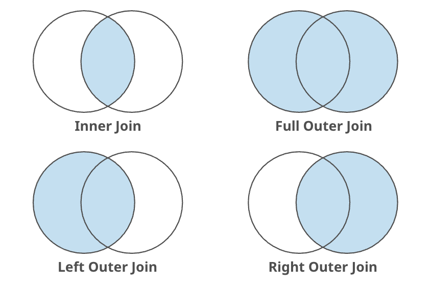

# SQL 심화
> 🗓️ **2025-10-23**  
✍🏼 **작성자 : unz**
---
## 📋 목차
1. 조인(Join)
2. 집계 함수(Aggregate Functions)
3. GROUP BY
4. 서브쿼리(Subquery)

---
**환자 Table**
|patient_id|name|birth_date|gender|visit_count|
|----------|----|----------|-------|----------|
|1|홍길동|M|5|1999-01-01|
|2|김철수|M|3|2000-02-02|
|3|이영희|F|8|1980-03-03|

**의사 Table**
|doctor_id|name|specialty|
|---------|----|---------|
|1|박의사|내과|
|2|최의사|정형외과|
|3|강의사|피부과|

**예약 Table**
|app_id|patient_id|doctor_id|visit_date|
|------|----------|---------|----------|
|1001|1|1|2025-10-22|
|1002|1|2|2025-10-23|
|1003|3|1|2025-10-24|
|1004|2|99|2025-10-25|


## 1. 조인(Join)
- 두 개 이상의 테이블을 서로 연결하여 데이터를 검색하는 방법



---

> `AS` : SQL에서 컬럼명이나 테이블명에 별칭(alias)을 붙이는 키워드  
`SELECT 컬럼명 AS 별칭 FROM 테이블명 AS 별칭;`

### 1-1. 내부 조인(INNER JOIN)
- 두 테이블 모두에 조인 조건이 일치하는 데이터 행만 가져온다.
- 한쪽 테이블에만 데이터가 있고 상대 쪽에는 매칭되는 값이 없는 경우 그 행은 결과에서 제외된다.
```SQL
SELECT a.app_id, d.name AS doctor_name, d.specialty, a.visit_date
FROM appointments a
INNER JOIN doctors d ON a.doctor_id = d.doctor_id;
```
|app_id|doctor_name|specialty|visit_date|
|--|--|--|--|
|1001|박의사|내과|2025-10-22|
|1002|최의사|정형외과|2025-10-23|
|1003|박의사|내과|2025-10-24|
- 1004번 예약(doctor_id=99)는 doctors에 없으므로 제외


### 1-2. 왼쪽 외부 조인(LEFT JOIN)
- 왼쪽 테이블의 모든 행을 포함하며, 오른쪽 테이블에서 조건이 일치하는 데이터 행을 가져온다.
- 오른쪽 테이블에 매칭되는 데이터가 없다면, 그부분은 NUL로 채워진다.
```SQL
SELECT a.app_id, d.name AS doctor_name, d.specialty, a.visit_date
FROM appointments a
LEFT JOIN doctors d ON a.doctor_id = d.doctor_id;
```
|app_id|doctor_name|specialty|visit_date|
|--|--|--|--|
|1001|박의사|내과|2025-10-22|
|1002|최의사|정형외과|2025-10-23|
|1003|박의사|내과|2025-10-24|
|1004|`NULL`|`NULL`|2025-10-25|
- appointments는 전부 출력된다.
- 1004번 예약(doctor_id=99)는 doctors에 없으므로 `NULL`

### 1-3. 오른쪽 외부 조인(RIGHT JOIN)
- 오른쪽 테이블의 모든 행을 포함하며, 왼쪽 테이블에서 조건이 일치하는 데이터 행을 가져온다.
- 왼쪽 테이블에 매칭되는 데이터가 없다면, 그부분은 NUL로 채워진다.

```SQL
SELECT a.app_id, d.name AS doctor_name, d.specialty, a.visit_date
FROM appointments a
RIGHT JOIN doctors d ON a.doctor_id = d.doctor_id;
```
|app_id|doctor_name|specialty|visit_date|
|--|--|--|--|
|1001|박의사|내과|2025-10-22|
|1002|최의사|정형외과|2025-10-23|
|1003|박의사|내과|2025-10-24|
|`NULL`|강의사|피부과|`NULL`|
- doctors는 전부 출력된다.
- 강의사(doctor_id=3)는 예약이 없으므로 app_id와 visit_date가 `NULL`

### 1-4. 완전 외부 조인(FULL JOIN)
- 양쪽 테이블 중 어느 한 곳에만 데이터가 있어도 모든 행을 가져온다.
- 두 테이블의 모든 데이터를 통합해서 보고 싶을 떄 사용한다.
- MySQL에서는 `UNION`으로 구현 가능하다.


## 2. 집계 함수(Aggregate Functions)
- 여러 행의 데이터를 그룹화하여 단일 값을 계산하는 함수

### 2-1. 주요 집계 함수
|함수|설명|예시|
|--|--|--|
|`COUNT()`|행의 개수 세기|`COUNT(*)`|
|`SUM()`|합계 계산|`SUM(visit_count)`|
|`AVG()`|평균 계산|`AVG(age)`|
|`MAX()`|최댓값 찾기|`MAX(bmi)`|
|`MIN()`|최솟값 찾기|`MIN(bmi)`|

```SQL
-- 전체 예약 건수 COUNT
SELECT COUNT(*) AS total_appointments
FROM appointments; -- 4

-- 중복 제거 후 개수
SELECT COUNT(DISTINCT doctor_id) AS unique_doctors
FROM appointments; -- 3

-- 전체 예약 중 첫 방문일과 마지막 방문일 찾기
SELECT MIN(visit_date) AS first_visit, -- 2025-10-22
       MAX(visit_date) AS last_visit   -- 2025-10-25
FROM appointments;

-- 환자 테이블 통계
SELECT
    COUNT(*) AS total_patients,
    SUM(visit_count) AS total_visits,
    AVG(visit_count) AS avg_visits,
    MAX(visit_count) AS max_visits,
    MIN(visit_count) AS min_visits
FROM patients;
```
|total_patients|total_visits|avg_visits|max_visits|min_visits|
|--|--|--|--|--|
|3|16|5.33|8|3|

## 3. GROUP BY
- 특정 컬럼을 기준으로 결과 집합을 그룹으로 묶는 것
- 집계 함수와 함께 사용되어, 각 그룹별 통계량을 계산할 떄 사용된다.
```SQL
SELECT 컬럼명, 집계함수()
FROM 테이블명
GROUP BY 컬럼명;
```

```SQL
-- 의사별 진료 횟수
SELECT doctor_id, COUNT(*) AS total_visits
FROM appointments
GROUP BY doctor_id;
```
|doctor_id|total_visits|
|--|--|
|1|2|
|2|1|
|99|1|

```SQL
-- 환자별 총 방문 횟수 & 평균 방문 간격
SELECT patient_id, 
       COUNT(*) AS total_visits,
       MIN(visit_date) AS first_visit,
       MAX(visit_date) AS last_visit,
FROM appointments
GROUP BY patient_id;
```
|patient_id|total_visits|first_visit|last_visit|
|--|--|--|--|
|1|2|2025-10-22|2025-10-22|
|2|1|2025-10-25|2025-10-25|
|3|1|2025-10-24|2025-10-24|

### 3-1. HAVING
- `GROUP BY`를 통해 생성된 그룹에 조건을 부여한다.
- `WHERE` :  **그룹화 전** 개별행에 대한 필터링
- `HAVING` : **그룹화 후**의 결과에 대한 필터링 

```SQL
-- 에약이 2회 이상인 의사만 조회
SELECT doctor_id, COUNT(*) AS total_visits
FROM appointments
GROUP BY doctor_id
HAVING COUNT(*) >= 2;
```
|doctor_id|total_visits|
|--|--|
|1|2|

```SQL
-- 여러 컬럼으로 GROUP BY (의사별 + 환자별) 조합으로 몇 번 만났는지 통계
SELECT doctor_id, patient_id, COUNT(*) AS visit_count
FROM appointments
GROUP BY doctor_id, patient_id;
```

|doctor_id|patient_id|visit_count|
|--|--|--|
|1|1|1|
|1|3|1|
|2|1|1|
|99|2|1|

## 4. 서브쿼리(Subquery)
- 하나의 SQL문 안에 포함된 또 다른 SQL문
- 메인쿼리를 돕는 중간 단계의 데이터를 생성하거나 필터링할 때 사용된다.

### 서브쿼리의 특징
- 반드시 괄호`()`로 감싸서 사용한다.
- 서브쿼리는 메인쿼리보다 먼저 실행된다.
- 서브쿼리 내에서는 `ORDER BY` 절을 사용할 수 없다. (일부 특수 상황 제외)

### 4-1. SELECT 절에서의 서브쿼리
- SELECT 절에서 하나의 컬럼처럼 사용된다.
- 반드시 단 하나의 값 (1행 1열)만 반환해야 한다.
```SQL
-- 각 의사별로 '총 예약 건수'를 한 컬럼으로 붙이기
SELECT name AS doctor_name,
       (SELECT COUNT(*)
       FROM appointments a
       WHERE a.doctor_id = d.doctor_id) AS total_visits
FROM doctors d;
```
|doctor_name|total_visits|
|--|--|
|박의사|2|
|최의사|1|
|강의사|0|

### 4-2. FROM 절에서의 서브쿼리 (인라인 뷰)
- 서브쿼리가 하나의 가상 테이블 역할을 한다.
- SQL문이 실행되는 동안만 존재하며, 반드시 별칭(AS)을 지정해줘야 한다.
```SQL
SELECT doctor_id, total_visits
FROM (
       SELECT doctor_id,  COUNT(*) AS total_visits
       FROM appointments
       GROUP BY doctor_id
) AS summary
WHERE total_visits >= 2;
```
|doctor_id|total_visits|
|--|--|
|1|2|

### 4-3. WHERE 절에서의 서브쿼리
- 조건절 내에서 비교 연산자와 함께 사용되어 데이터를 제한한다.
```SQL
-- 모든 예약 중에서 가장 최근에 방문한 예약 하나만 조회
SELECT *
FROM appointments
WHERE visit_date = (
       SELECT MAX(visit_date)
       FROM appointments
);
```
|app_id|patient_id|doctor_id|visit_date|
|--|--|--|--|
|1004|2|99|2025-10-25|

```SQL
-- 환자 테이블에 등록된 사람 중 실제 예약이 존재하는 환자만 조회
SELECT *
FROM patients
WHERE patient_id IN (
       SELECT patient_id
       FROM appointments
);
```