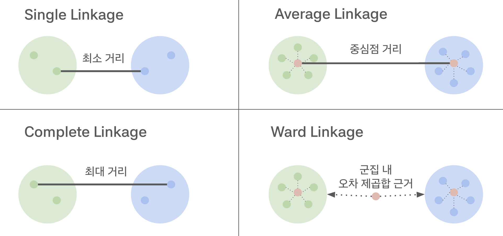

# 머신러닝 기초 (비지도학습)

> 🗓️ **2025-11-06**  
> ✍🏼 **작성자 : unz**

## 📝 목차

1. 비지도 학습 이란?
2. 차원의 저주
3. PCA
4. K-Means Clustering
5. Hierarchical Clustering
6. K-Means vs Hierarchical 비교
7. 군집화 평가 방법
8. 비지도 학습 활용 사례

---

## 1. 비지도 학습 (Unsupervised Learning) 이란?

> 입력 데이터($X$)에 대한 목표값($y$)이 주어지지 않은 상태에서 데이터 내부의 통계적 구조나 패턴을 찾아내는 학습 방법

- **차원 축소(Dimensionality Reduction)**: 데이터의 핵심 정보는 유지하면서 변수의 개수를 줄이는 것
- **군집화(Clustering)**: 유사한 특징을 가진 데이터끼리 그룹으로 묶는 것

### 1-1. 차원 축소 (Dimension Reduction)

> 수많은 특성(Feature) 중 중요한 정보를 보존하면서 변수의 개수를 줄이는 기법

- **PCA** : 선형 결합을 통해 분산이 최대인 방향으로 차원을 축소한다.
- **t-SNE** : 고차원 데이터의 인접성을 저차원에서도 유지하도록 하며, 주로 시각화에 특화되어 있다.
- **UMAP** : t-SNE보다 빠르고 데이터의 전역적 구조를 더 잘 보존하는 최신 기법

### 1-2. 군집화 (Clustering)

> 데이터의 유사성을 측정하여 서로 비슷한 데이터끼리 묶어주는 기법

- K-Means: 데이터를 K개의 중심점으로 할당하고 중심을 업데이트한다.
- DBSCAN: 밀도를 기반으로 군집을 형성하며, 이상치 탐지에 강점이 있다.
- Hierarchical : 데이터 간의 거리를 계층적인 트리 구조로 연결한다.

## 2. 차원의 저주 (Curse of Dimensionality)

> 데이터의 차원(Feature의 수)이 증가할수록 해당 공간의 크기가 기하급수적으로 커져서 데이터가 희소해지는 현상

- 데이터 사이의 거리가 너무 멀어져 유사도 측정이 어렵다.
- 모델 학습에 막대한 데이터와 연산량이 필요해진다.
- PCA와 같은 차원 축소 기법을 사용하여 유의미한 정보만 남기고 차원을 줄여야 한다.

## 3. PCA (Principal Component Analysis)

> 주성분 분석  
> 고차원 데이터를 정보 손실을 최소화하면서 분산이 가장 큰 방향의 새로운 좌표계로 투영하는 차원 축소 기법

### 3-1. PCA 동작 방식

1. 데이터 표준화
   - 각 특성을 평균 0, 분산 1로 스케일 차이 제거
2. 공분산 행렬 계산
   - 특성 간 관계 파악
3. 공분산 행렬의 고유 벡터 / 고유 값 계산
   - 고유 벡터 : 주성분 방향
   - 고유 값 : 그 방향의 분산
4. 고유값이 큰 순서대로 고유벡터 선택, 이 벡터들이 주성분(PC)이 된다.
   - PC1 : 데이터의 분산이 가장 큰 방향
   - PC2 : PC1과 수직이면서 남은 분산이 가장 큰 방향

### 3-2. 설명된 분산 (Explained Variance)

> 각 주성분이 전체 데이터 변동성의 몇 %를 차지하는지 나타낸다.

- 설명된 분산 비율 = 주성분의 고유 값 / 전체 고유값 합

```
Iris 예시 (4차원)
PC1: 73.0% (가장 중요)
PC2: 22.9%
PC3: 3.7%
PC4: 0.5%

PC1 + PC2 = 95.9% → 충분!

몇 개의 주성분을 선택할까?
목표: 85-95% 정보 보존
너무 많으면 → 차원 축소 효과 적음
너무 적으면 → 정보 손실 많음
```

### 3-3. Scree Plot

> 주성분 개수에 따른 고유값을 그래프로 나타낸 것

- 목표 : 각 군집 내 데이터와 중심점 간의 거리 합을 최소화하는 것
- 군집 내부는 가깝게, 군집 간은 멀게

```
그래프의 기울기가 급격히 감소하는 지점(Elbow)을 통해 적절한 차원 수를 결정한다.

PC1: ████████████████ 73%  ↑
PC2: ██████ 23%            ↑ 여기까지 선택
PC3: █ 4%                  ↓ 기울기 완만
PC4: ▌ 0.5%                ↓ 정보 적음
→ PC1, PC2만 사용하면 충분!
```

## 4. K-Means Clustering

> 데이터 세트를 K개의 고정된 군집으로 나누는 알고리즘

### 4-1. K-Means 동작 방식

1. $K$개의 초기 중심점을 랜덤하게 배치한다.
2. 각 데이터를 가장 가까운 중심점에 할당한다. (유클리디안 거리)
3. 할당된 데이터들의 평균값을 계산하여 새로운 중심점을 설정한다.
4. 중심점이 변하지 않을 때까지 2~3 과정을 반복한다.

### 4-2. K값 선택하기

- Elbow Method: K 증가에 따른 Inertia를 보고, 급격히 감소가 멈추는 지점(Elbow)을 선택
- Silhouette Score: 군집 내부의 응집도와 군집 간의 분리도를 수치화(-1 ~ 1사이, 1에 가까울수록 좋음).
- 도메인 지식: 비즈니스 목적상 필요한 그룹 수(예: 고객 등급 3단계)

## 5. Hierarchical Clustering

> 계층적 군집화, 군집의 계측 구조를 만들어가며 분류하는 기법

- K값을 미리 설정하지 않아도 된다.
- Dendrogram으로 시각화
- 군집 간 관계를 트리로 표현한다.

### 5-1. Hierarchical Clustering 동작 방식

- **Agglomerative (응집형)**
  - 상향식(Bottom-up)
  - 각 데이터를 개별 군집으로 시작해 가장 가까운 군집끼리 병합한다.
- **Divisive (분할형)**
  - 하향식(Top-down)
  - 모든 데이터를 포함한 하나의 큰 군집에서 시작해 점차 쪼개 나간다.

### 5-2. Linkage Method

- Single Linkage: 두 군집에서 가장 가까운 점 사이의 거리 기준
- Complete Linkage: 두 군집에서 가장 먼 점 사이의 거리 기준
- Average Linkage: 모든 점 쌍 사이의 평균 거리 기준
- Ward Linkage: 병합 후 군집 내 분산의 증가량을 최소화하는 방식 (가장 안정적)

  

### 5-3. Dendrogram

> 군집 간의 병합 과정을 계층 구조로 나타낸 나무 모양의 그래프

- 가로 축 : 각 데이터 포인트
- 세로 축 : 군집 간 거리
- 가지 : 군집이 합쳐지는 지점 (높을수록 멀리 떨어진 군집)

## 6. K-Means vs Hierarchical 비교

| 비교      | K-Means                     | Hierarchical                        |
| --------- | --------------------------- | ----------------------------------- |
| K값 지정  | 분석 전 미리 지정 필수      | 덴드로그램 확인 후 사후 결정 가능   |
| 속도      | 빠름 ($O(n)$)               | 느림 ($O(n^2)$ 또는 $O(n^3)$)       |
| 확장성    | 대용량 데이터에 적합        | 소규모 데이터에 적합                |
| 군집 모양 | 원형에 최적화               | 연결법에 따라 다양한 모양 대응 가능 |
| 재현성    | 초기값에 따라 결과가 달라짐 | 항상 동일한 결과                    |
| 시각화    | 산점도로 개별 확인          | 덴드로그램을 통한 구조 파악 용이    |

## 7. 군집화 평가 방법

> 비지도 학습은 정답이 없으므로 통계적 지표를 활용하여 평가한다.

- **Silhouette Score**
  - 데이터가 자신이 속한 군집과 얼마나 가깝고 다른 군집과는 얼마나 먼지 계산
  - -1 ~ 1 사이
  - 높을수록 좋음 (0.5 이상이면 타당한 군집화로 평가)
- **Davies-Bouldin Index**
  - 군집 내 분산과 군집 간 거리의 비율
  - 수치가 낮을수록 좋은 성능
- **Calinski-Harabasz Index**
  - 군집 간 분산과 군집 내 분산의 비율
  - 수치가 높을수록 군집이 잘 분리된 것
- **시각적 평가**
  - 산점도를 그려 실제 군집이 직관적으로 잘 나뉘었는지 확인
  - 비즈니스 관점에서 의미가 있는지 확인

## 8. 비지도 학습 활용 사례

- 고객 세분화 : 구매 패턴으로 고객 그룹화, 맞춤형 마케팅 전략
- 이상치 탐지 : 정상 패턴에서 벗어난 것 찾기, 사기 탐지, 불량품 검출
- 추천 시스템 : 비삿한 상품 / 사용자 찾기
- 이미지 압축 : 중요한 정보만 남기고 압축
