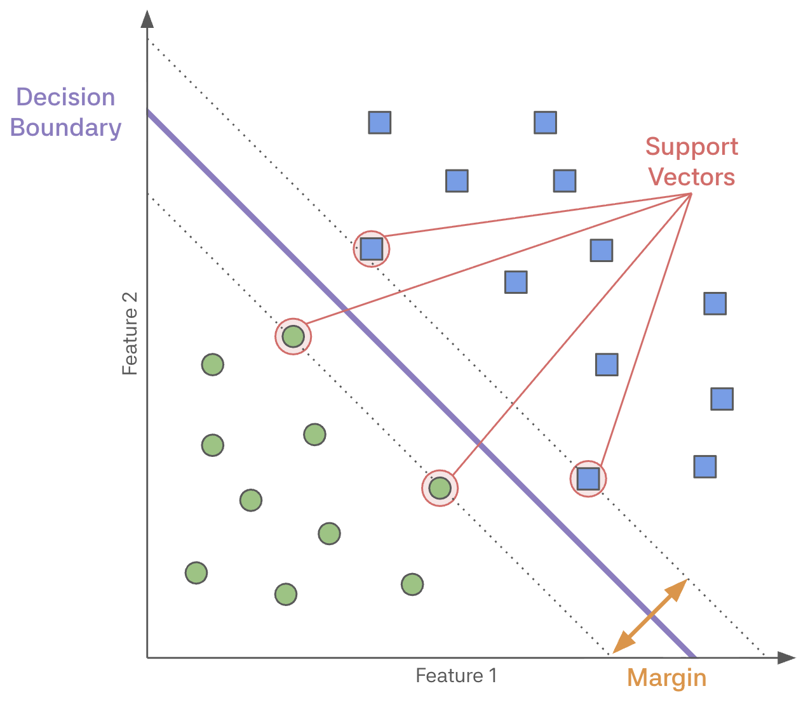
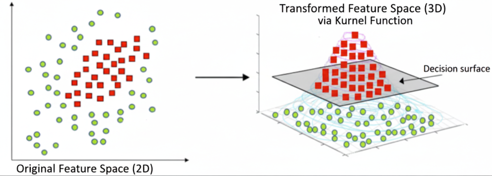

# 머신러닝 심화 (SVM)

> 🗓️ **2025-11-12**  
> ✍🏼 **작성자 : unz**

## 📝 목차

1. SVM 이란?
2. Maximal Margin Classifier
3. Lagrange Dual Formulation

---

## 1. SVM 이란?

> Support Vector Machine  
> 데이터를 분류하기 위한 최적의 결정 경계를 찾는 알고리즘

- 고차원 데이터 공간에서 두 클래스를 가장 잘 구분하는 초평면을 찾는 것이 핵심
- SVM의 목표는 Margin을 최대화 하는 것
- 새로운 데이터가 들어왔을 때도 틀리지 않도록 일반화 성능을 극대화하는 결정 경계를 찾는것이 목표이다.

## 2. Maximal Margin Classifier

- **결정 경계 (Decision Boundary)**
  - 데이터를 클래스별로 나누는 기준선
  - 2차원에서는 선, 3차원에서는 면, n차원에서는 초평면이라고 부른다.
- **서포트 벡터 (Support Vectors)**
  - 결정 경계와 가장 가까운 곳에 위치한 데이터 포인트
  - Margin 경계선 위에 정확히 위치해 있다.
  - 결정 경계를 정의하는 데 결정적인 역할을 한다.
- **마진 (Margin)**
  - 결정 경계와 서포트 벡터 사이의 거리
  - Margin width = $\frac{2}{||w||}$
  - $||w||$ 가 작을 수록 Margin이 넓어진다.
  - 마진이 넓을 수록 새로운 데이터에 대한 오분율이 낮아진다고 가정한다.
  - 이를 Maximal Margin Classifier라고 부른다.



---

| 나쁜 분류기          | 좋은 분류기            |
| -------------------- | ---------------------- |
| Margin 좁읍          | Margin 넓음            |
| 데이터에 너무 가까움 | 데이터로부터 여유 있음 |
| 새로운 데이터에 취약 | 새로운 데이터에 강함   |
| Overfitting 위험     | 일반화 성능 우수       |

### 2-1. 최적화 문제

```
왜 최적화 문제를 풀어야 할까?

두 그룹을 나누는 선을 무한히 많다.
그 중 어떤선을 선택해야하는지 수학적 기준이 필요하다.
→ Margin이 최대인 선을 선택해야 함
→ 최적화 문제
```

- 목표 : Margin $\frac{2}{||w||}$ 을 최대화 하는 경계선 찾기
- $||w||$ 이 작아지면 Margin이 커지기 때문에 $||w||$를 작게 만드는것이 목표이다.

## 3. Lagrange Dual Formulation

### 3-1. 커널 트릭(Kernel Trick)이란?

> 데이터를 고차원 공간으로 직접 보내지 않고도, 마치 보낸 것과 같은 효과는 내는 함수(Kernel)를 사용하는 기법

- 복잡한 비선형 문제를 효율적으로 해결할 수 있다.
- 고차원 계산 없이도 고차원의 효과를 낼 수 있다.



### 3-2. Dual 문제

- Primal 문제
  - 파라미터 $w$와 $b$를 직접 최적화
- Dual 문제
  - 라그랑주 승수 $\alpha$에 대한 문제로 변환
  - 데이터의 차원이 아닌 데이터의 개수에 영향을 받는다.
  - 데이터 간의 내적 형태로 수식이 정리된다.

```
왜 Dual 문제를 풀어야 할까?

1. Primal 문제
- 변수 개수 : d + 1 (특성차원 + 1)
- 문제점 : 고차원 데이터에서 d가 매우 클 수 있다.

2. Dual 문제
- 변수 개수 : n (데이터 개수)
- 장점 : d >> n인 경우 훨씬 효율적
        Kernel Trick 적용 가능
        계산이 더 쉽다.
```

### 3-3. Lagrangian

> 제약 조건이 있는 최적화 문제를 제약 조건이 없는 형태의 문제로 변환하여 풀기 위해 도입된 함수

- 제약 조건을 목적 함수에 "벌점(Penalty)"으로 포함
- 제약 위반 시 → 큰 벌점 부여
- Lagrange Multipliers
  - 각 제약 조건마다 αᵢ ≥ 0를 도입 (αᵢ = 벌점의 강도)
  - αᵢ = 0: 제약 잘 지킴, 벌점 없음
  - αᵢ > 0: 제약 경계에 있음, 벌점 있음

### 3-4. Support Vector 찾기

- 최적화 문제를 풀면 각 데이터 포인트에 대한 값(α)을 얻게 된다.
  - α = 0인 점: 일반 데이터 (무시해도 됨)
  - α > 0인 점: Support Vector (중요!)
- 이렇게 Support Vector만 찾아서 경계선을 만든다.
- 대부분의 데이터는 무시되고, 핵심 데이터만 사용하므로 효율적이다.
