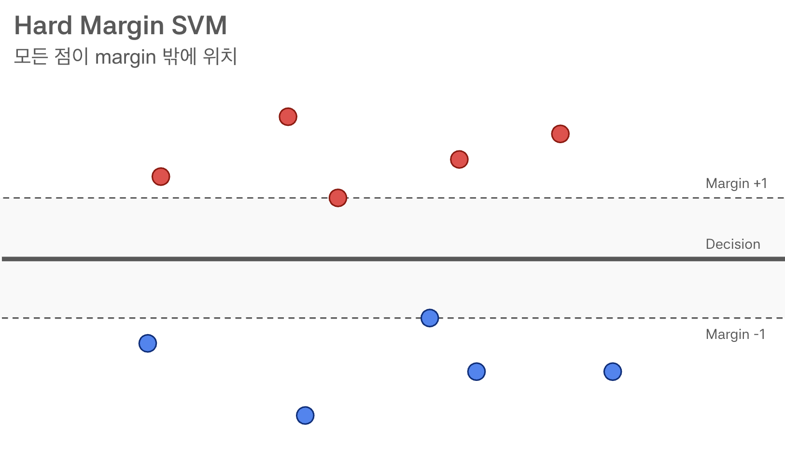
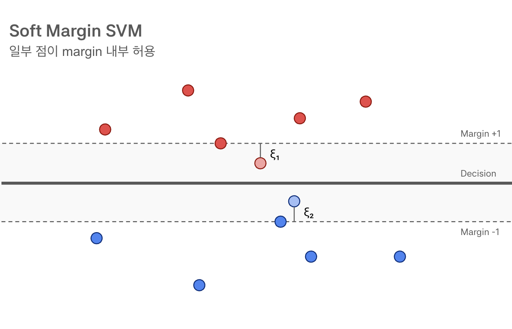
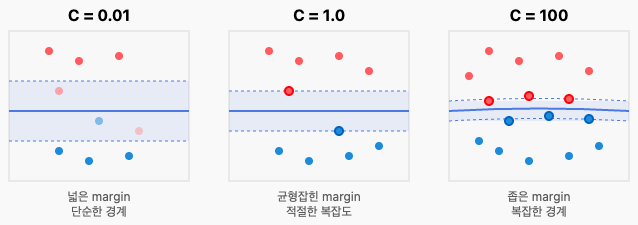
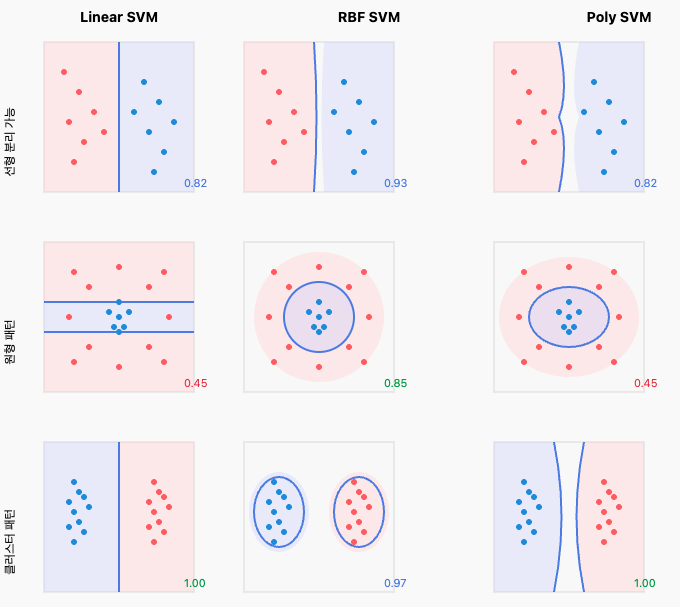

# 머신러닝 심화 (SVM 심화)

> 🗓️ **2025-11-13**  
> ✍🏼 **작성자 : unz**

## 📝 목차

1. Hard Margin SVM
2. Soft Margin SVM
3. Kernel Methods

---

## 1. Hard Margin SVM

### 1-1. Hard Margin이란?

> 데이터셋이 선형적으로 완벽하게 분리될 수 있다는 가정하에, 단 하나의 오차도 허용하지 않고 클래스를 분리하는 방식

- 모든 데이터 포인트가 결정 경계와 마진 바깥에 위치하도록 엄격한 제약 조건을 적용



### 1-2. Hard Margin의 한계

- **이상치에 매우 민감** : 단 하나의 데이터 포인트가 잘못된 위치에 있어도 결정 경계가 크게 왜곡된다.
- **과적합 위험**: 훈련 데이터에 지나치게 최적화되어 모델의 일반화 능력이 떨어진다.
- **선형 분리 불가능 시 실패** : 데이터가 조금이라도 겹쳐 있으면 모델 학습이 불가능하다.

## 2. Soft Margin SVM

### 2-1. Soft Margin이란?

> Hard Margin의 엄격함을 완화하여 어느 정도의 오차를 허용하면서 마진을 최대화하는 방식

- Slack Variable (ξ)를 도입하여 제약 조건 완화



### 2-2. Hard Margin vs Soft Margin 비교

|          | Hard Margin SVM                                                                        | Soft Margin SVM                                                          |
| -------- | -------------------------------------------------------------------------------------- | ------------------------------------------------------------------------ |
| 제약     | yᵢ(wᵀxᵢ + b) ≥ 1                                                                       | yᵢ(wᵀxᵢ + b) ≥ 1 - ξᵢ                                                    |
| 특징     | 모든 점을 완벽히 분류<br>선형 분리 가능한 경우만<br>Outlier에 매우 민감<br>과적합 경향 | 일부 오분류 허용<br>항상 해 존재<br>Outlier에 robust<br>일반화 성능 우수 |
| 사용시기 | 데이터가 매우 깨끗함<br>노이즈가 거의 없음<br>차원이 매우 높음                         | 현실 데이터 (노이즈 있음)<br>선형 분리 불가능<br>일반화가 중요함         |

### 2-3. Slack Variable (ξ)의 의미

> 각 데이터 포인트의 위반 정도 측정

```
총 페널티 = C × Σξᵢ
C가 클수록 오분류에 대한 페널티가 커짐
```

|        | ξᵢ = 0         | 0 < ξᵢ < 1                | ξᵢ = 1              | ξᵢ > 1        |
| ------ | -------------- | ------------------------- | ------------------- | ------------- |
| 위치   | Margin 밖      | Margin 내부, 올바른 쪽    | 정확히 결정 경계 위 | 잘못된 쪽     |
| 의미   | 완벽히 분류됨  | 분류는 맞지만 margin 위반 | 경계선상에 위치     | 완전히 오분류 |
| 페널티 | 제약 조건 만족 | 약간의 페널티             | 중간 페널티         | 큰 페널티     |

### 2-4. C 파라미터의 역할과 영향

> SVM에서 파라미터 C는 오차를 얼마나 허용할 것인가를 결정하는 규제 매개변수

- 모델의 복잡도와 일반화 성능 사이의 Trade-off를 조절한다.



| C가 작을 때 (C → 0)                                     | C가 적당할 때 (C = 1)                                     | C가 클 때 (C → ∞)                                       |
| ------------------------------------------------------- | --------------------------------------------------------- | ------------------------------------------------------- |
| Margin 최대화 우선<br>오분류 많이 허용<br>단순한 경계선 | 균형잡힌 trade-off<br>적절한 오분류 허용<br>적당한 복잡도 | 오분류 최소화 우선<br>거의 Hard Margin<br>복잡한 경계선 |
| Underfitting 가능성<br>높은 bias<br>낮은 variance       | 좋은 일반화<br>적절한 bias-variance<br>안정적인 성능      | Overfitting 위험<br>낮은 bias<br>높은 variance          |

## 3. Kernel Methods

### 3-1. Kernel Trick이란?

> 기존의 저차원 공간에서는 선형적으로 분리할 수 없는 데이터를 고차원 특징 공간으로 매핑하여 선형분리가 가능하게 만드는 기법


- 선형 SVM은 비선형 패턴을 분류할 수 없음
- 데이터를 고차원으로 매핑하여 선형 분리 가능하게 만듦
- 실제로 변환하지 않고 내적만 계산 (Kernel Trick)

### 3-2. 주요 Kernel 함수들

- 데이터의 분포 특성에 따라 적절한 커널을 선택하는 것이 중요하다.



### Linear Kernel

- 가장 기본이 되는 커널로, 별도의 변환 없이 원래 공간에서 선형 분리를 수행
- 특징(Feature)의 개수가 데이터 개수보다 훨씬 많을 때(예: 텍스트 분류) 주로 사용

### Polynomial Kernel

- 데이터를 다항식 차수($d$)만큼 고차원으로 투영
- 데이터가 비선형적이지만 정규화된 형태일 때 사용하며, 이미지 처리에서 종종 활용

### RBF Kernel

- SVM에서 가장 많이 사용되는 기본(Default) 커널
- 한한 차원의 공간으로 매핑하는 효과가 있으며, 두 데이터가 가까울수록 큰 값을 가진다.
- 감마($\gamma$) 파라미터가 하나의 데이터 샘플이 미치는 영향력의 거리를 결정한다. (값이 클수록 복잡한 경계)
  - γ = 0.1: 넓은 영향 범위, 부드러운 경계, Underfitting 가능
  - γ = 1: 적절한 복잡도, 균형잡힌 성능
  - γ = 10: 좁은 영향 범위, 복잡한 경계, 높은 training accuracy
  - γ = 100: 매우 복잡한 경계, 각 점 주변만 영향, 과적합!

### Sigmoid Kernel

- 신경망(Neural Network)의 활성화 함수와 유사한 형태를 띈다.
- 로지스틱 회귀와 유사한 결정을 내리며, 특정 조건 하에서 다층 퍼셉트론과 유사하게 작동한다.

### 3-3. Kernel 선택 가이드

| Kernel     | 복잡도 | 속도      | 파라미터     | 추천상황                                      |
| ---------- | ------ | --------- | ------------ | --------------------------------------------- |
| Linear     | 낮음   | 매우 빠름 | 없음         | 고차원 데이터<br>선형 분리 가능<br>텍스트분류 |
| Polynomial | 중간   | 보통      | degree, γ, r | 이미지 처리<br>특징 상호작용<br>다항식 관계   |
| RBF        | 높음   | 느림      | γ            | 기본 선택<br>비선형 패턴<br>복잡한 경계       |
| Sigmoid    | 중간   | 보통      | γ, r         | 특수 목적<br>신경망 유사                      |
