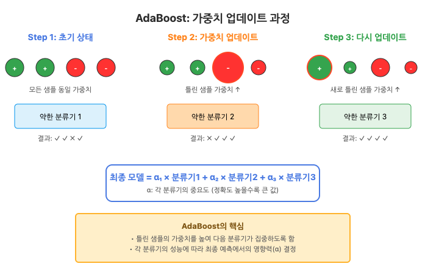
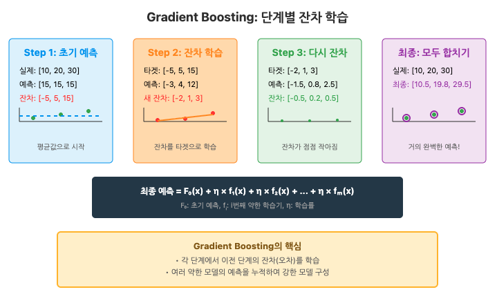

# 머신러닝 심화 (앙상블 학습 - Boosting)

> 🗓️ **2025-11-17**  
> ✍🏼 **작성자 : unz**

## 📝 목차

1. Boosting이란?
2. Bagging과 Boosting 차이점
3. AdaBoost
4. Gradient Boosting
5. XGBoost
6. LightGBM

---

## 1. Boosting이란?

> 여러 개의 약한 학습기를 순차적으로 학습시켜 그 결과를 결합함으로써 하나의 강한 학습기를 만드는 앙상블 기법

```
Weak Learner(약한 학습기)
- 무작위 추측보다는 성능이 조금 더 낫지만, 단독으로는 복잡한 문제를 풀기에 부족한 모델
- 편향이 높고 분산이 낮다.

Strong Learner(강한 학습기)
- 복잡한 패턴을 잘 인식하고 높은 예측 정확도를 가진 모델
- 부스팅 과정을 통해 여러 개의 약한 학습기가 결합되어 편향을 대폭 줄인 결과물
```

### 1-1. Boosting의 두 가지 핵심 요소

- **데이터 가중치(Data Weighting)**
  - 이전 단계에서 틀린 데이터 샘플에 더 높은 가중치를 부여하여 다음 모델이 그 데이터를 더 중요하게 처리하도록 한다.
- **모델 신뢰도(Model Weighting)**
  - 약한 학습기 중 성능이 좋은 모델에게는 최종 결과 결정 시 더 큰 발언권(가중치)를 부여한다.

## 2. Bagging과 Boosting 차이점

| 항목        | Bagging                        | Boosting                                  |
| ----------- | ------------------------------ | ----------------------------------------- |
| 학습 방식   | 병렬적                         | 순차적                                    |
| 데이터 활용 | 복원 추출을 통한 독립적 샘플링 | 이전 오차를 바탕으로 가중치 조정된 샘플링 |
| 목표        | 분산 감소 (과적합 방지)        | 편향 감소 (정확도 향상)                   |
| 계산 속도   | 빠름 (병렬처리 가능)           | 상대적으로 느림 (이전 결과 필요)          |

## 3. AdaBoost (Adaptive Boosting)

> 틀린 데이터에 대해 가중치를 높게 부여하여 다음 모델이 그 데이터를 더 잘 맞추도록하는 방식

### 3-1. 학습 과정

1. 모든 샘플에 동일한 가중치를 부여한다.
2. 첫 번째 약한 학습기를 학습시키고 에러율을 계산한다.
3. 틀린 샘플의 가중치는 높이고, 맞은 샘플은 낮춘다.
4. 이 새로운 가중치를 바탕으로 두 번째 학습기를 학습시킨다.
5. 최종적으로 학습기들의 성능에 따른 가중치를 적용해 합친다.



## 4. Gradient Boosting (GBM)

> 가중치 대신 잔여 오차를 다음 모델의 타겟값으로 사용하는 방식

- 경사하강법을 사용하여 손실 함수를 최소화 한다.
- 속도가 느리고 과적합 위험이 있다.

### 4-1. 학습 과정

1. 첫 번째 모델로 단순한 평균값 등을 예측한다.
2. 실제값과 예측값의 차이(잔여 오차)를 구한다.
3. 다음 모델은 이전 모델의 오차를 예측하도록 학습한다.
4. 새로운 모델의 결과에 학습률(Learning Rate)을 곱해 예측값에 더한다.
5. 오차가 최소화될 때까지 반복한다.



## 5. XGBoost (Extreme Gradient Boosting)

> GBM의 느린 속도와 과적합 문제를 해결하기 위해 고안된 라이브러리

- 병렬 처리 및 하드웨어 최적화로 속도가 빠르다.
- Regularization(L1, L2) 지원으로 과적합 방지
- 결측치 처리 기능 내장되어 있다.

### 5-1. 학습 과정

1. 모든 데이터에 대해 동일한 초기값을 예측값으로 설정한다.
2. 현재 모델의 오차를 기반으로 각 데이터 포인트의 Gradient와 Hessian 계산한다.
3. 최적의 분할 지점 탐색한다. (Gain 계산)
4. 트리가 완성된 후 설정된 gamma 값보다 Gain이 낮은 노드 가지치기
5. 새로 만들어진 트리의 예측값에 learning rate를 곱하여 기존모델에 더한다.

### 5-2. GBM과 XGBoost 비교

| 구분        | GBM                       | XGBoost                               |
| ----------- | ------------------------- | ------------------------------------- |
| 최적화 방식 | 1차 미분(Gradient)만 사용 | 1차(Gradient), 2차(Hessian) 미분 사용 |
| 속도        | 순차 학습으로 매우 느림   | 병렬 처리로 매우 빠름                 |
| 과적합 방지 | 별도의 규제 기능 부족     | L1, L2 Regularization 내장            |
| 결측치 처리 | 전처리 필수               | 자동 처리                             |
| 가지치기    | Pre-pruning               | Post-Pruning                          |

### 5-3. 하이퍼파라미터

| 하이퍼파라미터       | 설명                                        | 권장 시작값 | 탐색범위             |
| -------------------- | ------------------------------------------- | ----------- | -------------------- |
| `n_estimators`       | 트리 개수                                   | 100         | 100, 200, 500        |
| `eta`(learning_rate) | 각 트리 기여도 조절                         | 0.1         | 0.01, 0.05, 0.1, 0.3 |
| `max_depth`          | 트리 최대 깊이                              | 5           | 3, 5, 7, 9           |
| `gamma`              | 노드 분할을 결정하기 위한 최소 손실 감소 값 | 0           | 0, 1, 3, 5           |
| `lambda`             | L2 정규화 가중치                            | 기본값 1    | 1, 5, 10             |
| `alpha`              | L1 정규화 가중치                            | 기본값 0    | 0, 0.1, 1            |
| `subsample`          | 각 트리 학습에 사용하는 행 샘플링 비율      | 0.8         | 0.7, 0.8, 0.9        |
| `colsample_bytree`   | 각 트리 학습에 사용하는 열 샘플링 비율      | 0.8         | 0.7, 0.8, 0.9        |

## 6. LightGBM

> XGBoost보다 빠르고 적은 메모리를 사용하도록 설계된 알고리즘

- 대용량 데이터 세트 처리에 최적화되어 있다.
- 수직적 확장(Leaf-wise)방식을 선택하여 손실을 더 크게 줄인다.
- 속도가 매우 빠르고 메모리 사용량이 적다.

### 6-1. 학습 과정

1. 손실이 가장 큰 노드(Leaf)를 깊게 확장하여 오차를 줄인다.
2. Gradient가 작은 샘플은 무시하고 큰 샘플 위주로 학습하여 속도를 높인다.
3. 희소한 특성들을 하나로 묶어 연산량을 줄인다.

### 6-2. 하이퍼파마리터

| 하이퍼파라미터     | 설명                                    | 특징                              |
| ------------------ | --------------------------------------- | --------------------------------- |
| `num_leaves`       | 하나의 트리가 가질 수 있는 최대 잎의 수 | 가장 중요한 파라미터              |
| `learning_rate`    | 학습률                                  | XGBoost와 동일                    |
| `max_depth`        | 트리 최대 깊이                          | Leaf-wise 방식이라 깊게 설정 가능 |
| `min_data_in_leaf` | 한 잎에 포함되어야 하는 최고 데이터 수  | 과적합 방지용 (LGBM 전용)         |
| `feature_fraction` | 피처 샘플링 비율                        | 0.8 내외                          |
| `bagging_fraction` | 데이터 샘플링 비율                      | 0.8 내외                          |
