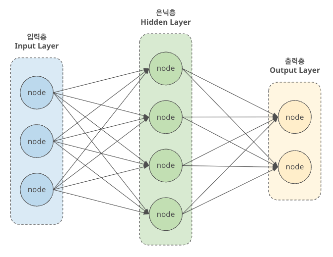
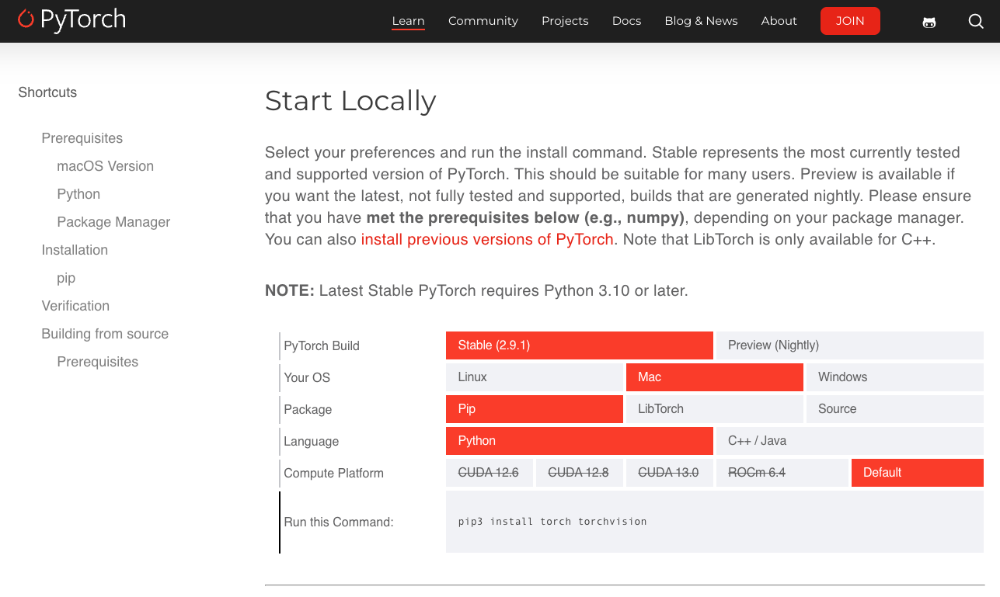

# 딥러닝 기초

> 🗓️ **2025-11-28**

## ✍🏼 **작성자 : unz**

## 📝 목차

1. 퍼셉트론
2. 다층 퍼셉트론
3. 인공신경망
4. 딥러닝
5. 활성화 함수
6. 손실 함수
7. 오차역전파
8. 경사하강법
9. 딥러닝 지원 파이썬 라이브러리

---

## 1. 퍼셉트론(Perceptron)

> 1957년 프랑크 로젠블라트(Frank Rosenblatt)가 고안한 알고리즘  
> 인간 신경세포(뉴런)를 모델링한 인공 신경망의 가장 기초적인 단위

- **입력과 출력**: 여러 신호를 입력받아 하나의 신호를 출력한다.
- **가중치와 편향**: 각 입력 신호에 고유한 가중치를 곱하고, 편향을 더한 값이 임계값을 넘으면 1, 그렇지 않으면 0을 출력한다.
- **한계**: 직선 하나로 구역을 나누는 선형 분류기이기 때문에 XOR 문제와 같은 비선형 문제를 해결할 수 없다.

## 2. 다층 퍼셉트론(MLP, Multi-Layer Perceptron)

> 퍼셉트론을 여러 층으로 쌓아 올려 만든 신경망

- 단층 퍼셉트론이 해결하지 못한 비선형 문제를 해결하기 위해 등장했다.
- 입력층(Input Layer), 은닉층(Hidden Layer), 출력층(Output Layer)으로 구성
- 각 층 사이에 ReLU나 Sigmoid 같은 비선형 함수를 추가하여 데이터의 복잡한 패턴을 학습할 수 있게한다.

## 3. 인공신경망(ANN, Artificial Neural Network)

> 뇌의 신경망 구조를 모방하여 만든 수학적 모델의 총칭

- 보통 MLP와 같은 구조를 넓은 의미에서 ANN이라고 부른다.
- 노드: 뇌의 뉴런에 해당하며, 연산이 이루어지는 단위
- 연결 강도: 노드 간의 연결선에 부여된 가중치, 학습을 통해 이 값이 최적화 된다.



## 4. 딥러닝(Deep Learning)

> 인공신경망의 은닉층을 아주 깊게 쌓아 올린 머신러닝의 한 분야

- 사람이 직접 특징을 설계할 필요 없이, 데이터로부터 직접 유용한 특징을 모델이 스스로 찾아낸다.
- 이미지, 음성, 텍스트와 같은 비정형 데이터 처리 능력에 압도적이다.
- 데이터의 양이 많아질수록 모델의 성능이 계속해서 향상되는 경향이 있다.

### 4-1. 딥러닝의 종류

- **합성곱 신경망 (CNN, Convolutional Neural Network)**
  - 용도: 이미지 처리, 컴퓨터 비전
  - 특징: 커널(필터)를 이용해 이미지의 공간적 정보를 유지하며 특징을 추출한다.
- **순환 신경망 (RNN, Recurrent Neural Network)**
  - 용도: 시계열 데이터, 자연어 처리
  - 특징: 이전 시점의 출력이 다음 시점의 입력으로 들어가는 순환구조를 가져 데이터의 순서 정보를 학습한다.
- **Transformer**
  - 용도: 최신 자연어 처리(GPT, BERT)
  - 특징: 매커니즘을 사용하여 데이터 내의 모든 요소간의 관계를 한 번에 파악한다.
  - 병렬처리가 가능하고 RNN보다 훨씬 긴 문맥을 이해할 수 있다.

### 4-2. 딥러닝의 학습 과정

1. **순전파 (Forward Propagation)**
   - 데이터가 신경망의 입력층에서 출력층 방향으로 전달한다.
   - 각 층의 뉴런들은 입력 데이터에 가중치를 곱하고, 편향을 더한 뒤 활성화 함수를 거쳐 다음 층으로 신호를 보낸다.
   - 출력층에 도달하면 신경망의 예측값이 나온다.
2. **손실 함수 계산 (Loss Function)**
   - 신경망의 예측값과 실제 정답 사이의 차이를 계산한다.
   - MSE, Cross-Entropy
3. **역전파 (Backpropagation)**
   - 계산된 손실을 바탕으로 출력층에서 다시 입력층 방향으로 거꾸로 거슬러 올라간다.
   - 각 가중치가 오차에 얼마나 기여했는지(기울기)를 계산한다.
4. **옵티마이저를 통한 가중치 업데이트 (Optimizer)**
   - 구해진 기울기를 이용해 손실을 최소화하는 방향으로 가중치를 수정한다.
   - 이때 얼마나 큰 폭으로 수정할지를 결정하는 것이 학습률(Learning Rate)
5. **반복 (Iteration & Epoch)**
   - 위의 1~4번 과정을 전체 데이터에 대해 반복한다.
   - Epoch: 전체 학습 데이터를 한 번 모두 훑었을 때를 1Epoch이라고 한다.
   - 반복을 통해 손실이 충분히 작아지면 학습을 종료한다.

## 5. 활성화 함수(Activation Function)

> 입력 신호의 총합을 출력 신호로 변환하는 함수

- 신경망에서 비선형성을 추가하여, 단순한 선형 결합으로는 해결할 수 없는 복잡한 문제를 해결할 수 있게해준다.

### 5-1. 주요 활성화 함수

- **계단 함수(Step Function)**
  - 입력이 0을 넘으면 1을 출력하고, 그렇지 않으면 0 출력
  - 미분이 불가능하여 현대적인 딥러닝에서는 거의 사용되지 않음
- **시그모이드 함수(Sigmoid Function)**
  - 출력값을 0과 1사이의 부드러운 곡선으로 변환
  - 층이 깊어질수록 기울기가 사라지는 기울기 소설 문제 발생
- **ReLU 함수(Rectified Linear Unit)**
  - 입력이 0보다 크면 그대로 출력하고, 0 이하면 0 출력
  - 연산 속도가 매우 빠르고 기울기 소실 문제를 완화

## 6. 손실 함수(Loss Function)

> 모델이 예측한 값과 실제 값의 차이를 수치화하는 함수

- MSE (Mean Squared Error): 회귀 문제에 주로 사용
- Cross-Entropy (교차 엔트로피): 분류 문제에 주로 사용

## 7. 오차역전파(Backpropagation)

> 신경망의 출력값과 실제 정답 사이의 오차를 계산하여, 이를 출력층에서 입력층 방향으로 거꾸로 전파하며 각 가중치를 업데이트하는 알고리즘

- 수치 미분 대신 연쇄 법칙을 사용하여 기울기를 효율적으로 계산한다.
- 각 층의 가중치가 전체 오차에 기여한 정도를 파악하여 모델을 최적화한다.

## 8. 경사하강법(Gradient Descent)

> 함수의 기울기를 구하여 기울기가 낮은 쪽으로 반복해서 이동하며 손실 함수의 최솟값을 찾는 최적화 알고리즘

## 9. 딥러닝 지원 파이썬 라이브러리

| 라이브러리   | 특징                                                                           |
| ------------ | ------------------------------------------------------------------------------ |
| Scikit-learn | 머신러닝의 표준 라이브러리. 데이터 전처리, 전통적 머신러닝 알고리즘에 강력함   |
| TensorFlow   | 구글에서 개발한 오픈소스 프레임워크. 대규모 분산 처리에 최적화됨               |
| Keras        | 텐서플로우 위에서 동작하는 고수준 API, 사용자 친화적이며 모델 구현이 매우 빠름 |
| PyTorch      | 메타(페이스북)에서 개발, Define-by-Run 방식으로 유연함                         |

### 9-1. TensorFlow 설치

```bash
# 새 가상 환경 만들기
conda create -n deeplearning python=3.12

# 가상 환경 활성화
conda activate deeplearning

# tensorflow 설치
conda install tensorflow
```

### 9-2. PyTorch 설치

- https://pytorch.org/get-started/locally/
- 공식 홈페이지에서 사양에 맞게 옵션 선택
- Run This Command의 명령어 실행



```bash
# 설치 확인
import torch
import tensorflow as tf

print(f"PyTorch 버전: {torch.__version__}")
print(f"TensorFlow 버전: {tf.__version__}")
```
