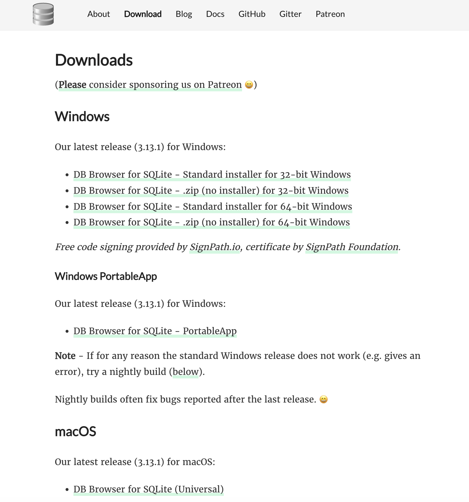
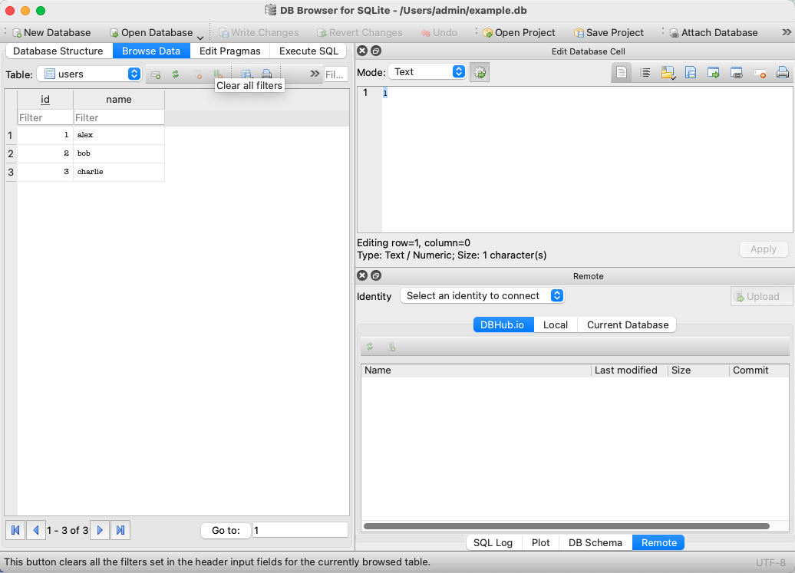
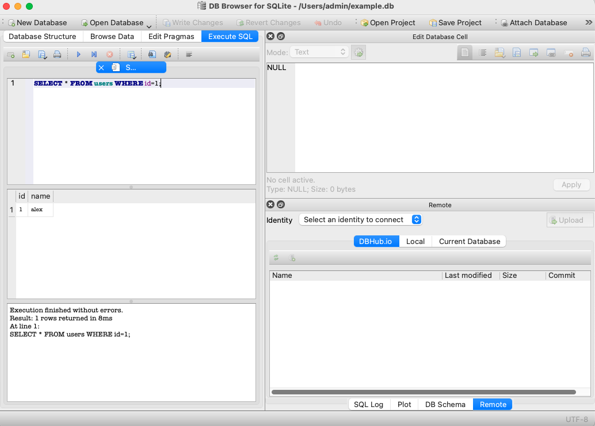

# 웹 서비스 기초와 구조에 대한 이해

> 🗓️ **2025-12-24**

## ✍🏼 **작성자 : unz**

## 📝 목차

1. HTTPS란?
2. HTTPS의 암호화 방식
3. TLS 핸드셰이크(TLS Handshake)란?
4. Keep-alive(지속 연결)이란?
5. 데이터(Data)란?
6. 관계형 데이터베이스 관리 시스템(RDBMS)
7. 서버와 데이터베이스
8. SQL
9. SQLite
10. Network

---

## 1. HTTPS란?

- HyperText Transfer Protocol Secure
- 웹 브라우저와 웹 서버 간의 데이터를 전송하기 위해 사용하는 HTTP 프로토콜의 **보안 버전**
- HTTP + TLS(Transport Layer Security)

> HTTP는 평문으로 전송하기 때문에 해킹에 취약하다.  
> 중간 경로에 있는 누구나 패킷을 그대로 읽을 수 있고, 로그인 정보, 쿠키, 내용 정보 전부 노출 가능하다.

### 1-1. HTTP와 HTTPS의 차이점

| 구분     | HTTP                                  | HTTPS                            |
| -------- | ------------------------------------- | -------------------------------- |
| 보안성   | 암호화되지 않은 평문 전송 (도청 가능) | 데이터 암호화 전송               |
| 인증     | 서버의 신원 확인 불가                 | 인증서를 통해 서버의 신뢰성 검증 |
| SEO 영향 | 검색 엔진 최적화에 불리함             | Google 등 검색 엔진 가산점 부여  |

## 2. HTTPS의 암호화 방식

### 2-1. 대칭키 암호화 (Symmetric Key Encryption)

- 암호화와 복호화에 동일한 키를 사용하는 방식
- 송신자와 수신자가 같은 키를 공유한다.
- 계산 속도가 매우 빠르다.
- 키를 안전하게 전달하기 어렵다.

### 2-2. 공개키 암호화 (Public Key Encryption / Asymmetric)

- 공개키(Public Key)와 개인키(Private Key)라는 한 쌍의 키를 사용하는 방식
- 공개키로 암호화한 데이터는 오직 개인키로만 복호화할 수 있다.
- 키 전달이 안전하다.
- 연산량이 많아 속도가 느리다.

## 3. TLS 핸드셰이크(TLS Handshake)란?

- HTTPS 통신을 시작하기 전, 클라이언트와 서버가 서로를 탐색하고 보안 연결을 설정하는 과정

### 3-1. HTTPS 동작 방식

<span style="background-color:#AFD4F7">서버 공개키</span>
<span style="background-color:#FFAACA">서버 비밀키</span>
<span style="background-color:#FCFC6A">클라이언트 대칭키</span>

|     |           |     |                                                                                                                               |
| --- | --------- | --- | ----------------------------------------------------------------------------------------------------------------------------- |
| 1.  | 브라우저  | →   | 서버 접속 요청                                                                                                                |
| 2.  | 서버      | →   | SSL 인증서(<span style="background-color:#AFD4F7">공개키</span> 포함) 전달                                                    |
| 3.  | 브라우저  | →   | 인증서 신뢰 여부 확인(CA)                                                                                                     |
| 4.  | 브라우저  | →   | <span style="background-color:#FCFC6A">대칭키</span>를 <span style="background-color:#AFD4F7">공개키</span>로 암호화해서 전달 |
| 5.  | 서버      | →   | <span style="background-color:#FFAACA">비밀키</span>로 복호화하여 <span style="background-color:#FCFC6A">대칭키</span> 획득   |
| 6.  | 이후 통신 | →   | <span style="background-color:#FCFC6A">대칭키</span>로 빠르게 암호화                                                          |

## 4. Keep-alive(지속 연결)이란?

- 한 번 연결된 TCP 연결을 끊지 않고 일정 시간 동안 유지하여 여러 개의 파일을 주고받을 수 있게 하는 기술
  > \*TCP(Transmission Control Protocol) : IP 위에서 작동하는 전송 계층 프로토콜  
  > 장치들 사이에 신뢰성 있는 데이터 전송을 보장하기 위해 연결을 설정하고 확인하는 절차를 거친다.

### 4-1. Keep-alive가 없을 때 (비지속 연결)

- 요청마다 매번 TCP 연결를 연결하고 끊는 과정 반복
- 매번 TLS handshake 발생 → 지연 증가, 서버와 클라이언트 부담 증가

### 4-2. Keep-alive가 있을 때 (지속 연결)

- 최초 요청 시 TCP 연결 + TLS handshake 1회
- 이후 요청들은 같은 연결 + 같은 대칭키 사용 → 성능 향상, 지연 감소

---

## 5. 데이터(Data)란?

|                   |                                                 |                                        |
| ----------------- | ----------------------------------------------- | -------------------------------------- |
| 데이터(Data)      | 가공되지 않은 사실이나 값                       | 25, 2025-12-24                         |
| 정보(Information) | 데이터를 맥락에 맞게 정리∙해석한 것             | 사용자의 나이는 25세이다.              |
| 지식(Knowledge)   | 정보를 이해하고 판단∙행동에 활용할 수 있는 상태 | 25세 사용자는 이 상품의 주요 타겟이다. |

### 5-1. 데이터의 활용

- 데이터가 해석되면 정보가 되고, 정보를 활용되면 지식이 된다.
- 해석되지 않은 데이터는 정보가 아니고, 활용되지 않는 정보는 가치로 이어지지 않기 때문에 데이터를 쌓기만 하는건 의미가 없다.
- 데이터는 저장보다 분석과 활용을 전제로 설계되어야 한다.

### 5-2. 데이터베이스(DataBase)

- 데이터를 체계적으로 저장하고, 빠르고 안전하게 관리하기 위한 저장소

| 특징        |     |                                          |
| ----------- | --- | ---------------------------------------- |
| 체계적 저장 | →   | 데이터를 구조적으로 관리하기 위한 저장소 |
| 빠른 조회   | →   | 필요한 데이터를 효율적으로 검색          |
| 일관성 유지 | →   | 데이터 오류와 중복 최소화                |
| 동시 접근   | →   | 여러 사용자가 동시에 사용 가능           |
| 영속성      | →   | 서버가 종료되어도 데이터 유지            |
| 보안관리    | →   | 접근 권한과 데이터 보호 지원             |

### 5-3. 관계형 데이터베이스(Relational Database)

- 데이터를 표(테이블) 형태로 저장하고, 테이블 간의 관계를 통해 관리하는 데이터베이스

|                    |     |                                                      |                         |
| ------------------ | --- | ---------------------------------------------------- | ----------------------- |
| 테이블(Table)      | :   | 같은 종류의 데이터를 행과 열로 모아 놓은 데이터 구조 |                         |
| 행(Row)            | :   | 하나의 데이터 묶음, 보통 하나의 객체를 의미          | 예시) 사용자 1명        |
| 열(Column)         | :   | 데이터의 속성                                        | 예시) id, 이름, 이메일  |
| 관계(Relationship) | :   | 테이블과 테이블 사이의 연결, 키(id)를 통해 서로 참조 | 예시) 사용자 ↔ 주문정보 |

### 5-4. 외래키(Foreign Key)

- 한 테이블의 열이 다른 테이블의 기본키를 참조하여 테이블 간의 관계를 나타내는 키
- 두 테이블을 연결해주는 역할
- 주로 참조하는 테이블의 기본키를 참조
  > 기본 키(Primary Key): 각 행을 고유하게 식별하기 위한 열

```
예시)
주문 테이블의 user_id가 사용자 테이블의 id를 참조하는 경우
게시글 테이블의 author_id가 사용자 테이블의 id를 참조하는 경우
댓글 테이블의 post_id가 게시글 테이블의 id를 참조하는 경우
```

### 5-5. 데이터 간 관계의 가치

1. **의미 있는 정보 생성** : "사용자"는 단순 정보, "사용자"와 "주문"을 연결하면 "누가 무엇을 샀는지" 알 수 있음
2. **중복 제거** : 사용자 정보를 주문마다 저장하지 않아도 됨
3. **확장성** : 주문, 결제, 배송 테이블 등 다른 테이블을 계속 연결 가능

## 6. 관계형 데이터베이스 관리 시스템(RDBMS)

- 관계형 데이터베이스를 생성·저장·조회·관리하기 위한 소프트웨어

> 예시)

- MySQL
- PostgreSQL
- Oracle Database
- Microsoft SQL Server

### 6-1. RDB vs RDBMS

- **RDB(관계형 데이터베이스)** → 데이터의 구조와 개념
- **RDBMS(관계형 데이터베이스 관리 시스템)** → 그 구조를 실제로 저장·관리하는 소프트웨어

## 7. 서버와 데이터베이스

- **서버(Server)**: 사용자의 요청을 받아 비즈니스 로직을 실행하고, 어떤 데이터가 필요한지 판단
- **데이터베이스(DB)**: 서버의 요청에 따라 데이터를 안전하게 저장하고, 빠르게 찾아서 반환
  > 서버는 직접 데이터를 기억하지 않고, 필요한 순간에 DB에 질의(Query)한다.  
  > DB는 서버의 요청에 응답만 할 뿐, 서비스 로직은 서버가 책임진다.

## 8. SQL

- Structured Query Language
- 데이터베이스에 데이터를 저장하고, 조회하고, 수정하기 위해 사용하는 표준 질의 언어

```SQL
-- 사용자 조회
SELECT * FROM users;

-- 사용자 추가
INSERT INTO users (name, email)
VALUES ('alex', 'alex@test.com');

-- 사용자 정보 수정
UPDATE users
SET email = 'bob@test.com'
WHERE id = 1;

-- 사용자 삭제
DELETE FROM users WHERE id = 1;
```

## 9. SQLite

- 파일 기반의 경량 관계형 데이터베이스
- 별도 서버 없이 하나의 파일로 데이터베이스를 사용
- Python에 기본 내장되어 있어 설치 불필요
- 설치·운영 부담 없이 로컬에서 데이터를 다뤄야 할 때 많이 사용

```Python
import sqlite3
# DB 연결
conn = sqlite3.connect("example.db")
cursor = conn.cursor()

# 테이블 생성
cursor.execute("""
CREATE TABLE IF NOT EXISTS users (
    id INTEGER PRIMARY KEY AUTOINCREMENT,
    name TEXT
)
""")

# 데이터 추가
cursor.execute("INSERT INTO users (name) VALUES (?)", ("alex",))
cursor.execute("INSERT INTO users (name) VALUES (?)", ("bob",))
cursor.execute("INSERT INTO users (name) VALUES (?)", ("charlie",))

# 변경 사항 저장
conn.commit()

# 데이터 조회
cursor.execute("SELECT id, name FROM users")
rows = cursor.fetchall()

# 연결 종료
conn.close()

```

## 9-1. DB Browser for SQLite

- SQLite 데이터베이스 파일을 GUI로 열어보고 수정할 수 있는 도구
- 설치 : https://sqlitebrowser.org/dl/
  

- Open Database를 통해 Browse Data탭에서 위에서 생성한 example.db 파일을 확인 할 수 있다.
  

- Execute SQL를 통해 직접 SQL문을 실행할 수 있다.
  

## 10. Network

- 여러 컴퓨터가 서로 연결되어 통신할 수 있는 구조
- 서로 데이터를 주고받을 수 있도록 연결된 컴퓨터들의 집합
  - 집 안의 와이파이
  - 회사 내부 네트워크
  - 전 세계를 연결한 인터넷

### 10-1. 인터넷과 네트워크의 차이

- 네트워크 : 기술적인 연결 그 자체를 의미
- 인터넷 : 전 세계의 수많은 개별 네트워크들을 하나로 묶어놓은 네트워들의 네트워크를 의미

> 인터넷의 본질은 **데이터 보내기**와 **데이터 받기**  
> → 데이터를 주고 받을 수 있는 주소 체계가 필요  
> → 어느 컴퓨터로 보낼지 (IP 주소)  
> → 그 컴퓨터의 어떤 프로그램으로 보낼지 (Port 번호)

### 10-2. IP 주소(IP Address)란?

- 네트워크가 연결된 각 기기가 가지는 고유한 식별 번호
- 데이터를 보낼 때 수신측이 어디인지 정확히 찾기 위해 필요하다.
- 인터넷에서 집 주소의 역할

```
예시)
IPv4 : 192.168.0.1
```

### 10-3. 포트(Port)란?

- 하나의 IP 주소 내에서 실행되고 있는 특정 프로그램이나 서비스로 들어가는 문
- IP 주소만으로는 데이터가 어떤 프로그램으로 가야 하는지 알 수 없기 때문에 포트 번호로 구분한다.

```
예시)
웹 서비스(HTTP): 80번 포트
보안 웹 서비스(HTTPS): 443번 포트
파일 전송(FTP): 21번 포트
```

### 10-4. IP + Port가 함께 쓰이는 이유

- IP 만 있으면 컴퓨터까지만 도착 (아파트 단지 주소)
- Port 까지 있어야 어떤 서비스인지 정확히 전달 (동/호수)

### 10-5. DNS(Domain Name System)란?

- 사람이 읽기 쉬운 도메인 이름을 컴퓨터가 이해하는 IP주소로 변환해주는 서비스
- 인터넷의 전화번호부 역할

```
예시)
사용자가 https://www.google.com 를 입력하면?
브라우저 내부에서는

1. DNS에 IP 질의
2. IP 응답 수신(142.250.206.238)
3. https → 기본 포트 443 선택
4. 서버(142.250.206.238:443)로 요청 전송
```
