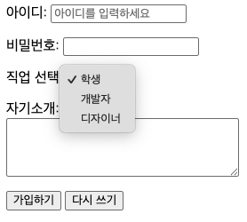

# HTML CSS 기초

> 🗓️ **2025-12-30**  
> ✍🏼 **작성자 : unz**

## 📝 목차

1. Table
2. Form
3. 정규식(Regular Expression)
4. div
5. class 속성
6. CSS(Cascading Style Sheets)란?
7. CSS 적용 방식
8. 선택자(Selectors)

---

## 1. Table

- 데이터를 행(Row)과 열(Column)로 구성된 격자 형태로 보여줄 때 사용한다.
- table row 형식으로 쌓인다.

### 1-1. Table 기본 구조

- `<table>` : 테이블 전체 범위 정의
- `<tr>` (Table Row) : 테이블 한 행 정의
- `<th>` (Table Header) : 테이블 제목 정의
- `<td>` (Table Data) : 테이블 데이터 정의

```HTML
<!-- table 기본구조 -->
<table>
  <tr>
    <th>이름</th>
    <th>나이</th>
  </tr>
  <tr>
    <td>홍길동</td>
    <td>20</td>
  </tr>
</table>

```

### 1-2. Table Semantic Tags

- `caption` : 테이블 제목이나 설명 정의 (항상 `<table>` 바로 다음에 위치)
- `thead` : 테이블 헤더 그룹화
- `tbody` : 테이블 데이터 그룹화
- `tfoot` : 테이블 footer 그룹화

### 1-3. Table Attributes

- `colspan=숫자` : 숫자만큼 열 병합
- `rowspan=숫자` : 숫자만큼 행 병합

## 2. Form

- 사용자로부터 정보를 입력 받아 서버로 전송하기 위해 사용한다.
- 로그인, 회원가입, 검색 창 등

### 2-1. Form 기본 구조

- `<form>` : 폼의 전체 범위 정의
- `action` : 데이터를 보낼 서버의 URL 지정
- `method` : 전송 방식(`GET`:URL에 노출, `POST`: 본문에 숨겨 전송) 지정

### 2-2. 입력 요소 태그

- `<input>` : 입력 태그, type 속성에 따라 모양과 용도가 변경된다.

| input type | 설명                        | input attribute | 설명                          |
| :--------: | --------------------------- | :-------------: | ----------------------------- |
|   `text`   | 한 줄 텍스트 입력           |  `placeholder`  | 안내문구                      |
|  `number`  | 숫자 입력                   |   `maxlength`   | 입력 최댓값 (숫자는 max)      |
| `password` | 비밀번호 입력               |   `minlength`   | 입력 최솟값 (숫자는 min)      |
|  `email`   | 이메일 입력                 |   `required`    | 필수 입력값                   |
|  `radio`   | 여러 옵션 중 하나만 선택    |   `disabled`    | 입력 불가                     |
| `checkbox` | 여러 옵션 중 다수 선택 가능 |     `value`     | 초기 값                       |
|   `file`   | 파일 선택                   |    `accept`     | input type file의 확장자 지정 |

- `<textarea>` : 여러 줄 텍스트 입력
- `<select>` & `<option>` : 드롭다운 목록 정의
- `<label>` : 입력 요소에 이름을 붙여준다.
  - 사용자가 라벨을 클릭하면 연결된 입력창이 활성화된다.
  - `for` 속성에 연결할 요소의 `id` 값을 넣어서 사용한다.
- `<button>` : 클릭 가능한 버튼 정의
  - `type="submit"` : 폼 제출(기본값)
  - `type="reset"` : 입력 내용 초기화
  - `type="button"` : 순수 버튼(자바스크립트 연결용)

```HTML
<form action="/submit-data" method="POST">
  <!-- 텍스트 입력 -->
  <p>
    <label for="username">아이디:</label>
    <input
      type="text"
      id="username"
      name="user_id"
      placeholder="아이디를 입력하세요"
    />
  </p>

  <!-- 비밀번호 입력 -->
  <p>
    <label for="userpw">비밀번호:</label>
    <input type="password" id="userpw" name="user_pw" />
  </p>

  <!-- 드롭다운 선택 -->
  <p>
    <label for="job">직업 선택:</label>
    <select id="job" name="user_job">
      <option value="student">학생</option>
      <option value="developer">개발자</option>
      <option value="designer">디자이너</option>
    </select>
  </p>

  <!-- 여러 줄 입력 -->
  <p>
    <label for="message">자기소개:</label><br />
    <textarea id="message" name="user_bio" rows="4" cols="30"></textarea>
  </p>

  <!-- 버튼 -->
  <button type="submit">가입하기</button>
  <button type="reset">다시 쓰기</button>
</form>

```



## 3. 정규식(Regular Expression)

- `<input>` 태그의 `pattern` 속성을 사용하여 사용자 입력을 검증할 수 있다.
- 기본 구조: `<input type="text" pattern="정규표현식">`
- 주요 예시:
  - 숫자만 : [0-9]\*
  - 영문 대문자만 : [A-Z]\*
  - 이메일 형식 : [a-z0-9._%+-]+@[a-z0-9.-]+\.[a-z]{2,}$
  - 전화번호 : \d{3}-\d{4}-\d{4}

```HTML
<!-- 전화번호 입력형식 체크 -->
<label for="phone">Phone</label>
<input
  type="text"
  required
  placeholder="010-1111-1111"
  pattern="010-[0-9]{4}-[0-9]{4}"
  title="010-1111-1111 형식으로 입력하세요"
/>
```

## 4. div

- 특정 구역을 그룹화할 때 사용하는 태그
- 블록 레벨 요소
- 한 줄 전체를 차지하고, 다음에 오는 요소는 자동으로 줄바꿈되어 아래에 배치된다.
- 웹 사이트의 큰 레이아웃을 나눌 때 사용한다.

## 5. class 속성

- 여러 HTML 요소에 동일한 스타일이나 기능을 적용하기 위해 사용하는 식별자
- 한 페이지 내에서 여러 번 중복해서 사용할 수 있다.

```HTML
<p class="text">Hello</p>
<p class="text">World</p>
```

## 6. CSS(Cascading Style Sheets)란?

- HTML 문서가 사용자에게 어떻게 보일지 결정하는 스타일 시트 언어
- 배경색, 글꼴, 레이아웃, 애니메이션 등을 담당한다.
- Cascading(폭포수): 스타일 우선순위가 위에서 아래로 흐르며 적용된다는 의미

## 7. CSS 적용 방식

### 7-1. 인라인 스타일(Inline Style)

- HTML 태그안에 직접 style 속성을 사용하여 작성
- 해당 요소에만 즉각 적용되어 우선순위가 매우 높다.
- 유지보수가 어렵고 HTML 코드가 지저분해진다.

```HTML
<!-- 각 태그에 직접 style 적용 -->
<p style="font-size: x-large;">Lorem, ipsum dolor.</p>
<p style="font-size: medium;">Lorem ipsum dolor sit amet.</p>
<p style="font-size: xx-small;">Lorem ipsum dolor, sit amet consectetur adipisicing.</p>

<!-- div에 공통 스타일 적용 -->
<div style="text-align: center;">
  <p style="font-size: x-large;">Lorem, ipsum dolor.</p>
  <p style="font-size: medium;">Lorem ipsum dolor sit amet.</p>
  <p style="font-size: xx-small;">Lorem ipsum dolor, sit amet consectetur adipisicing.</p>
</div>
```

### 7-2. 내부 스타일 시트(Internal CSS)

- HTML 문서의 `<head>` 섹션 안에 `<style>` 태그를 만들어 작성
- 한 페이지 내의 모든 요소 스타일을 한 곳에서 관리할 수 있다.
- 여러 페이지에 동일한 스타일을 적용하려면 코드를 복사해야 하므로 효율이 떨어진다.
- 기본 구조 : `selector {property: value}`

```HTML
<head>
  <style>
    body {
      background-color: #f0f0f0;
    }
    h1 {
      color: navy;
    }
    div {
      text-align: center;
    }
  </style>
</head>
```

### 7-3. 외부 스타일 시트(External CSS)

- CSS코드를 별도의 CSS 파일에 작성하고 이를 HTML 문서에 연결하여 사용하는 방식
- 여러개의 HTML 문서가 하나의 CSS 파일을 공유할 수 있다.
- HTML은 구조에만 집중하고, CSS는 디자인에만 집중하여 코드의 가독성이 높아진다.

```HTML
<!DOCTYPE html>
<html lang="en">
<head>
    <meta charset="UTF-8">
    <meta name="viewport" content="width=device-width, initial-scale=1.0">
    <title>CSS 연결 예제</title>
    <!-- link 태그를 사용하여 CSS 파일 연결 -->
    <link rel="stylesheet" href="style.css">
</head>
<body>
    <h1>CSS 연결 예제</h1>
</body>
</html>
```

```CSS
/* style.css */
h1 {
  color: ##1A1A1A;
  text-align: center;
}
```

## 8. 선택자(Selectors)

> 스타일을 적용할 HTML 요소를 선택하는 규칙

### 8-1. 기본 선택자(Basic Selectors)

| 선택자 종류   | 구문             | 설명                                   |
| ------------- | ---------------- | -------------------------------------- |
| 전체 선택자   | `*`              | 페이지의 모든 요소 선택                |
| 태그 선택자   | `h1`, `p`, `div` | 특정 HTML 태그를 모두 선택             |
| 클래스 선택자 | `.class`         | 특정 클래스명을 가진 요소를 선택       |
| 아이디 선택자 | `#id`            | 특정 아이디를 가진 단 하나의 요소 선택 |

### 8-2. 복합 선택자(Combinators Selectors)

> 요소 간의 관계(부모, 자식, 형제 등)를 이용하여 선택

| 선택자 종류      | 구문      | 설명                                         |
| ---------------- | --------- | -------------------------------------------- |
| 자손 선택자      | `div p`   | div 안의 모든 p 태그 선택                    |
| 자식 선택자      | `div > p` | div 바로 아래에 있는 직계 자식 p 태그만 선택 |
| 인접 형제 선택자 | `div + p` | div 바로 다음에 오는 형제 p 태그 하나만 선택 |
| 일반 형제 선택자 | `div ~ p` | div 바로 다음에 오는 모든 형제 p 태그 선택   |

### 8-3. 속성 선택자(Attribute Selectors)

> HTML의 속성 유무, 값을 기준으로 선택

| 구문                   | 설명                                 |
| ---------------------- | ------------------------------------ |
| `[attribute]`          | attribute 속성이 있는 요소           |
| `A[attribute]`         | attribute 속성이 있는 모든 A 요소    |
| `[attribute="value"]`  | attribute 속성값이 정확히 value 요소 |
| `[attribute^="value"]` | value로 시작하는 요소                |
| `[attribute$="value"]` | value로 끝나는 요소                  |
| `[attribute*="value"]` | value을 포함하는 요소                |

### 8-4. 가상 클래스 선택자(Pseudo-classes Selectors)

> 요소의 특정 상태나 구조적 위치에 따라 선택

| 구문                 | 설명                                                                            |
| -------------------- | ------------------------------------------------------------------------------- |
| `:hover`             | 마우스를 올렸을 때                                                              |
| `:focus`             | 포커스가 맞춰졌을 때                                                            |
| `:not(A)`            | A 선택자가 아닌 요소                                                            |
| `:empty`             | 자식 요소가 없는 비어있는 요소                                                  |
| `:first-child`       | 첫 번째 자식                                                                    |
| `:last-child`        | 마지막 자식                                                                     |
| `:nth-child(n)`      | n번째 자식 요소                                                                 |
| `:nth-last-child(n)` | 뒤에서부터 n번째 자식 요소                                                      |
| `:only-child`        | 부모의 유일한 자식(형제가 없는) 요소                                            |
| `:first-of-type`     | 동일한 태그 타입을 가진 형제 중 첫 번째 요소                                    |
| `:last-of-type`      | 동일한 태그 타입을 가진 형제 중 마지막 요소                                     |
| `:nth-of-type(n)`    | 동일한 태그 타입을 가진 형제 중 n번째 요소                                      |
| `:nth-of-type(An+B)` | 동일한 태그 타입을 가진 형제 중 수식을 이용해 선택 (`2n`은 짝수, `2n+1`은 홀수) |
| `:only-of-type`      | 동일한 태그 타입을 가진 형제가 자신뿐인 요소                                    |

### 8-5. 가상 요소 선택자(Pseudo-elements Selectors)

| 구문           | 설명                                       |
| -------------- | ------------------------------------------ |
| `::before`     | 요소의 컨텐츠 시작 부분에 가상 컨텐츠 삽입 |
| `::after`      | 요소의 컨텐츠 끝 부분에 가상 컨텐츠 삽입   |
| `::first-line` | 요소의 첫 번째 줄만 선택                   |
