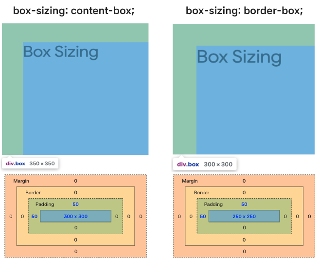

# HTML CSS 기초

> 🗓️ **2025-12-31**  
> ✍🏼 **작성자 : unz**

## 📝 목차

1. CSS Box Model
2. Font
3. Display

---

## 1. CSS Box Model

> 브라우저가 HTML 요소를 화면에 랜더링할 때, 모든 요소를 박스 형태로 취급하는 개념


### 1-1. Box Model 구성요소

- **Margin** : 테두리 바깥쪽 여백, 다른 요소와의 간격을 조절한다.
  - 속기형 `margin : top right bottom left;`
- **Border** : 패딩과 마진 사이의 경계선
  - 테두리 굵기, 스타일, 색상 지정 `border : 1px soild black;`
  - 꼭짓점 둥글게 만들기 `border-radius : 50px; border-radius : 50%;`
- **Padding** : 테두리와 콘텐츠 사이의 안쪽 여백
  - 속기형 `padding : top right bottom left;`
- **Content** : 실제 내용이 표시되는 영역

### 1-2. box-sizing

> 요소의 너비와 높이를 계산하는 기준 정의

- **content-box (기본값)**
  - 설정한 너비와 높이는 오직 Content 영역에만 적용
  - 요소 전체 너비 : `width + padding + border`
- **border-box**
  - 설정한 너비와 높이가 Padding과 Border를 포함한 크기에 적용
  - Padding, Border를 추가해도 요소의 전체 크기가 고정 된다.
  - 요소 전체 너비 : `width` (Padding과 Border가 포함됨)

```CSS
.box {
  box-sizing: content-box;
  /* content-box | border-box */
  width: 300px;
  height: 300px;
  padding-top: 50px;
  padding-left: 50px;
  background-color: #afd4f7;
}
```



## 2. Font

> 텍스트의 서체, 크기, 굵기 등 텍스트 스타일 제어 속성

```CSS
/* font-weight, size, family 각각 작성하거나 */
    h1 {
      font-weight: bold;
      font-size: x-large;
      font-family: 'Times New Roman', Times, serif;
    }

/* font 속성을 사용하여 순서대로 작성할 수 있음 */
/* 순서 : font-weight → font-size → font-family */
/* font-size와 font-family가 반드시 포함되어야 함 */
    h2 {
      font: bold large 'Times New Roman', Times, serif;
    }

```

### 2-1. Font-family

- 글꼴 종류를 지정한다.
- 사용자의 시스템에 특정 글꼴이 없을 경우를 대비해 여러 글꼴을 쉽표로 나열한다.
- 맨 마지막에는 보통 `sans-serif`, `serif` 같은 범용 서체로 마무리한다.

```HTML
<!DOCTYPE html>
<html lang="en">
  <head>
    <meta charset="UTF-8" />
    <meta name="viewport" content="width=device-width, initial-scale=1.0" />
    <title>Google Fonts 적용 예제</title>
    <!-- link 태그를 사용하여 Google에서 제공하는 웹 폰트 연결 -->
    <link rel="preconnect" href="https://fonts.googleapis.com" />
    <link rel="preconnect" href="https://fonts.gstatic.com" crossorigin />
    <link
      href="https://fonts.googleapis.com/css2?family=Poppins&display=swap"
      rel="stylesheet"
    />
  </head>
  <body>
    <h1>Google Fonts</h1>
  </body>
</html>

```

```CSS
.poppins-regular {
  font-family: "Poppins", sans-serif;
  font-weight: 400;
  font-style: normal;
}
```

## 3. Display

> 요소가 화면 상에서 어떻게 배치될지 결정하는 속성

### 3-1. Block

- 항상 새로운 줄에서 시작하며, 가로 너비를 100% 차지한다.
- width, height, margin, padding을 자유롭게 조절할 수 있다.
- 대표 요소 : `<div>`, `<h1>`, `<p>`, `<ul>`

### 3-2. Inline

- 줄바꿈 없이 다른 요소와 나란히 배치되며, 컨텐츠의 크기만큼만 너비를 차지한다.
- width와 height를 지정할 수 없다.
- margin-top, margin-bottom이 적용되지 않는다.
- 대표 요소 : `<span>`, `<a>`, `<strong>`

### 3-3. Inline-block

- 배치는 Inline처럼 한 줄에 여러 개 배치되지만, 기능은 block처럼 크기와 여백 조정이 가능하다.
